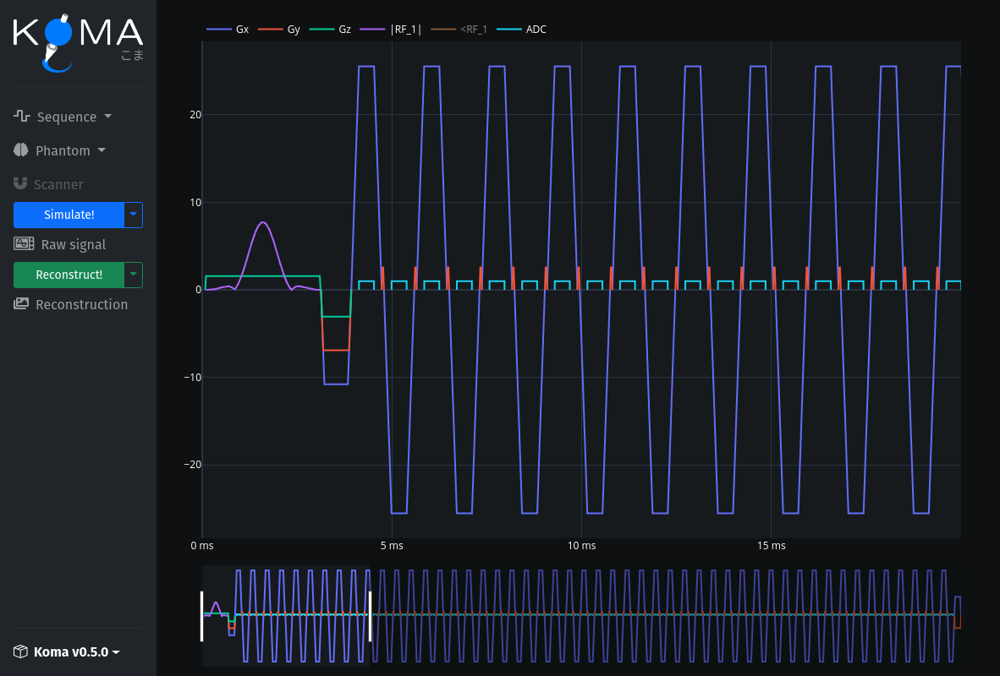
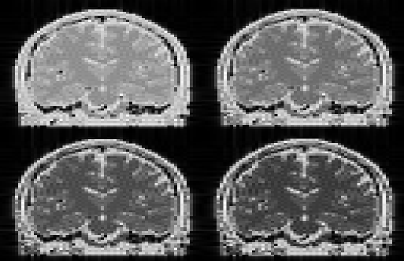
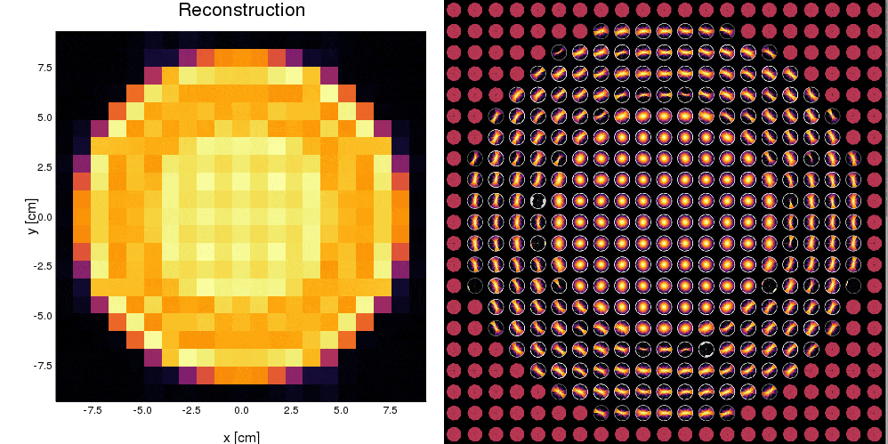

# Koma.jl

<p align="center">


</p>


[](https://cncastillo.github.io/MRIsim.jl/) [](https://zenodo.org/badge/latestdoi/252201289)


Koma.jl, whose name comes from the Japanese word for spinning-top こま (ko-ma), is a Julia package to simulate Magnetic Resonance Imaging (MRI) acquisitions. The main focus of this package is to simulate general scenarios that could arise in pulse sequence development. 

**TO-DO**:
 - [x] Phantom and Sequence data-types,
 - [x] Spin preccesion in gradient-only blocks,
 - [x] GPU accelaration using CUDA.jl,
 - [x] RF excitation,
 - [X] GPU accelaration of RF excitation (under development),
 - [ ] [Pulseq](https://github.com/imr-framework/pypulseq) IO and [auxiliary functions](https://github.com/imr-framework/pypulseq/tree/master/pypulseq),
 - [ ] Signal "Raw Output" dictionary ([ISMRMRD](https://ismrmrd.github.io/)),
 - [ ] [MRIReco.jl](https://magneticresonanceimaging.github.io/MRIReco.jl/latest/) for the reconstruciton,
 - [ ] Scanner data-type: , etc.,
 - [ ] Diffusion models with Laplacian Eigen Functions,
 - [ ] Magnetic susceptibility,
 - [ ] Coil sensitivities,
 - [ ] Documentation.


**ISMRM 2020 Presentation**: [MRIsim - Carlos Castillo.pdf](others/MRIsim-CarlosCastillo.pdf)

## Installation
To install just do the following:

```julia
] add MRIsim
```
## First run
MRIsim.jl comes with a handy GUI that contains a brain phantom with an EPI sequence. To open it use:

```julia
SpinLab()
```
Then, press the button that says "Run simulation!" to do your first simulation :).

## How to cite
If you use this package please acknowledge us by citing:

```bibtex
@software{carlos_castillo_passi_2021_5507370,
  author       = {Castillo-Passi, Carlos and Irarrazaval, Pablo},
  title        = {cncastillo/MRIsim.jl},
  month        = sep,
  year         = 2021,
  publisher    = {Zenodo},
  version      = {v0.3.8},
  doi          = {10.5281/zenodo.5784237},
  url          = {https://doi.org/10.5281/zenodo.5784237}
}
```

---

## SpinLab GUI



---

## Example 1: Brain phantom for different TEs



## Example 2: dMRI with multiple diffusion directions  



## Example 3: Moment-compensated diffusion


