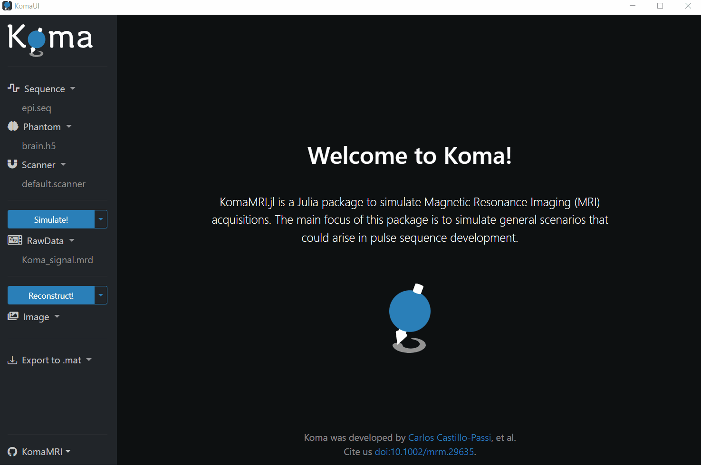

<p align="center">


</p>

<div align="center">
 
![][julia-110] [![][gh-actions-komamri]][gh-actions-url] [![][buildkite-badge]][buildkite-url] [![][codecov-komamri]][codecov-url] [![][license]][license-url] [![][julia-blue]][julia-blue-url] [![][total-downloads-komamri]][downloads-komamri-url] ![][gh-starts-komamri]

[![][docr-img]][docr-url] [![][docd-img]][docd-url] [![][paper-img]][paper-url]

</div>
 
KomaMRI.jl is a Julia package for highly efficient ⚡ MRI simulations. KomaMRI was built from the ground up to be: easy to use, extensible, cross-platform, and powered by open-source community standards.

<div align="center">

<table>
<tr>
<td rowspan="2" width="50%"></td>
<td align="left" width="50%"><b>Features:</b></td>
</tr>
<tr>
<td align="left">

- Fast simulations with CPU/GPU parallelization 🏃💨
- Extensible, so anyone can include new features 🆙
- Supports community-standards [🤝](## "Pulseq and ISMRMRD") 
- Interactive visualizations using PlotlyJS.jl 📲
- Cross-platform (Windows, Mac & Linux) 🌐
- Friendly GUI (using web technologies) 😌
- Compatible with modern notebooks [🎈](## "Pluto and Jupyter") 
- Flexible API for advanced users 👨‍💻
</td>
</tr>
</table>

</div>

<div align="center">
 
| **Packages**                                | **Stable Version**                           | **Build Status**                            | **Code Coverage**                     | **Downloads**                                       |
|:------------------------------------------- |:---------------------------------------------|:--------------------------------------------|:--------------------------------------|:----------------------------------------------------|
| 📦 [KomaMRI.jl](## "User Interface")        | [![][komamri-version]][komamri-juliahub]     | [![][gh-actions-komamri]][gh-actions-url]   | [![][codecov-komamri]][codecov-url]   | [![][downloads-komamri]][downloads-komamri-url]     |
| └ 📦 [KomaMRIBase.jl](## "Custom Types")    | [![][komabase-version]][komabase-juliahub]   | [![][gh-actions-komabase]][gh-actions-url]  | [![][codecov-komabase]][codecov-url]  | [![][downloads-komabase]][downloads-komabase-url]   |
| └ 📦 [KomaMRICore.jl](## "Simulation")      | [![][komacore-version]][komacore-juliahub]   | [![][gh-actions-komacore]][gh-actions-url]  | [![][codecov-komacore]][codecov-url]  | [![][downloads-komacore]][downloads-komacore-url]   |
| └ 📦 [KomaMRIFiles.jl](## "Input/Output")   | [![][komafiles-version]][komafiles-juliahub] | [![][gh-actions-komafiles]][gh-actions-url] | [![][codecov-komafiles]][codecov-url] | [![][downloads-komafiles]][downloads-komafiles-url] |
| └ 📦 [KomaMRIPlots.jl](## "Plots")          | [![][komaplots-version]][komaplots-juliahub] | [![][gh-actions-komaplots]][gh-actions-url] | [![][codecov-komaplots]][codecov-url] | [![][downloads-komaplots]][downloads-komaplots-url] |

</div>

## Table of Contents  
- [News](#news)  
- [Installation](#installation)
- [First run](#first-run)
- [How to Contribute](#how-to-contribute)
- [How to Cite](#how-to-cite)
- [Tested compatibility](#tested-compatibility) 

## News

- **(29 Aug 2024)** Our first GSoC student, Ryan Kierulf, presented his fantastic work at the JuliaHealth monthly meeting 🥳! (presentation available [here](https://www.youtube.com/watch?v=R6Z20G0J4bM)) More info in the docs: [GPU Parallelization](https://juliahealth.org/KomaMRI.jl/dev/explanation/4-gpu-explanation/), [Distributed Simulations](https://juliahealth.org/KomaMRI.jl/dev/how-to/4-run-distributed-simulations/) and [Ryan's JuliaHealth blog](https://juliahealth.org/JuliaHealthBlog/posts/ryan-gsoc/Ryan_GSOC.html)
- **(7 Dec 2023)** Koma was present in [MRI Together](https://mritogether.esmrmb.org/) 😼. The talk is available [here](https://www.youtube.com/watch?v=9mRQH8um4-A). Also, I uploaded the promised [educational example](https://juliahealth.org/KomaMRI.jl/stable/tutorial-pluto/01-gradient-echo-spin-echo/).
- **(17 Nov 2023)** Pretty excited of being part of [ISMRM Pulseq's virtual meeting](https://github.com/pulseq/ISMRM-Virtual-Meeting--November-15-17-2023). The slides available [here](https://github.com/pulseq/ISMRM-Virtual-Meeting--November-15-17-2023/blob/35a8da7eaa0bf42f2127e1338a440ccd4e3ef53c/slides/day3_KomaMRI_simulator_Quantitative_MRI.pdf).
- **(27 Jul 2023)** I gave a talk at MIT 😄 for [JuliaCon 2023](https://juliacon.org/2023/)! A video of the presentation can be seen [here](https://www.youtube.com/watch?v=WVT9wJegC6Q).
- **(29 Jun 2023)** [KomaMRI.jl's paper](https://onlinelibrary.wiley.com/doi/10.1002/mrm.29635) was chosen as a July editor's pick in MRM 🥳!
- **(6 Mar 2023)** Paper published in MRM 😃!
- **(8 Dec 2022)** [KomaMRI v0.7](https://github.com/JuliaHealth/KomaMRI.jl/releases/tag/v0.7.0): improved performance (**5x faster**), type stability, extensibility, and more!
- **(17 May 2022)** [ISMRM 2022 digital poster](https://archive.ismrm.org/2022/2815.html) presented in London, UK. Recording [here!](https://www.youtube.com/watch?v=tH_XUnoSJK8). Name change [MRIsim.jl -> KomaMRI.jl](https://github.com/JuliaHealth/KomaMRI.jl/releases/tag/v0.6.0).
- **(Aug 2020)** [Prehistoric version](https://github.com/JuliaHealth/KomaMRI.jl/releases/tag/v0.2.1-alpha) of Koma, MRIsim, presented as an [ISMRM 2020 digital poster](https://cds.ismrm.org/protected/20MProceedings/PDFfiles/4437.html) (virtual conference).

<details>
<summary> <samp>&#9776; Roadmap</samp></summary>

 v1.0: 
 - [x] Phantom and Sequence data types,
 - [x] Spin precession in gradient-only blocks (simulation optimization),
 - [x] GPU acceleration using CUDA.jl,
 - [x] RF excitation,
 - [x] GPU accelaration of RF excitation,
 - [x] Scanner data-type: , etc.,
 - [x] [Pulseq](https://github.com/imr-framework/pypulseq) IO,
 - [x] Signal "Raw Output" dictionary ([ISMRMRD](https://ismrmrd.github.io/)),
 - [x] [MRIReco.jl](https://magneticresonanceimaging.github.io/MRIReco.jl/latest/) for the reconstruciton,
 - [ ] Documentation,
 - [ ] [Auxiliary Pulseq functions](https://github.com/imr-framework/pypulseq/tree/master/pypulseq),
 - [ ] Coil sensitivities,
 - [ ] Cardiac phantoms and triggers.
 - [ ]  decay,

 Next:
 - [ ] Diffusion models with Laplacian Eigen Functions,
 - [ ] Magnetic susceptibility,
 - [ ] Use [PackageCompiler.jl](https://julialang.github.io/PackageCompiler.jl/dev/apps.html) to build a ditributable core or app.

</details>


## Installation
To install, just **type** `] add KomaMRI` in the Julia REPL or copy-paste the following into the Julia REPL:

```julia
pkg> add KomaMRI
pkg> add CUDA     # Optional: Install desired GPU backend (CUDA, AMDGPU, Metal, or oneAPI)

```
For more information about installation instructions, refer to the section [Getting Started](https://JuliaHealth.github.io/KomaMRI.jl/dev/how-to/1-getting-started) of the documentation.
## First run
KomaMRI.jl features a convenient GUI with predefined simulation inputs (i.e. `Sequence`, `Phantom`, and `Scanner`). To launch the GUI, use the following command:

```julia
using KomaMRI
using CUDA        # Optional: Load GPU backend (default: CPU)
KomaUI()
```
Press the button that says "Simulate!" to do your first simulation :). Then, a notification will emerge telling you that the simulation was successful. In this notification, you can either select to (1) see the Raw Data or (2) to proceed with the reconstruction.

> [!IMPORTANT]
> Starting from **KomaMRI v0.9** we are using [package extensions](https://pkgdocs.julialang.org/v1/creating-packages/#Conditional-loading-of-code-in-packages-(Extensions)) to deal with GPU dependencies, meaning that to run simulations on the GPU, installing (`add CUDA/AMDGPU/Metal/oneAPI`) and loading (`using CUDA/AMDGPU/Metal/oneAPI`) the desired backend will be necessary (see [GPU Parallelization](https://JuliaHealth.github.io/KomaMRI.jl/dev/explanation/4-gpu-explanation) and [Tested compatibility](#tested-compatibility)).  

## How to Contribute
KomaMRI exists thanks to all our contributors:

<a href="https://github.com/JuliaHealth/KomaMRI.jl/graphs/contributors">
  
</a>

Want to be highlighted here? We welcome contributions from the community! If you're interested in contributing, please read our [Contribution Guidelines](CONTRIBUTING.md) for details on how to get started.


## How to Cite
If you use this package, please cite our paper.

**Plain Text:**
> Castillo-Passi, C, Coronado, R, Varela-Mattatall, G, Alberola-López, C, Botnar, R, Irarrazaval, P. KomaMRI.jl: An open-source framework for general MRI simulations with GPU acceleration. Magn Reson Med. 2023; 1- 14. doi: 10.1002/mrm.29635

**BibTex:**
```bibtex
@article{https://doi.org/10.1002/mrm.29635,
         author = {Castillo-Passi, Carlos and Coronado, Ronal and Varela-Mattatall, Gabriel and Alberola-López, Carlos and Botnar, René and Irarrazaval, Pablo},
         title = {KomaMRI.jl: An open-source framework for general MRI simulations with GPU acceleration},
         journal = {Magnetic Resonance in Medicine},
         keywords = {Bloch equations, GPU, GUI, Julia, open source, simulation},
         doi = {https://doi.org/10.1002/mrm.29635},
         url = {https://onlinelibrary.wiley.com/doi/abs/10.1002/mrm.29635},
         eprint = {https://onlinelibrary.wiley.com/doi/pdf/10.1002/mrm.29635},
}
```

## Tested compatibility

All parallel backends are tested on Linux (besides Apple silicon) using the latest stable release, Julia 1 (stable), and Julia 1.9 (compat). 

<div align="center">

| KomaMRICore          | CPU                                 | GPU (Nvidia)                        | GPU (AMD)                        | GPU (Apple)                        | GPU (Intel)                        | 
|:---------------------|:-----------------------------------:|:-----------------------------------:|:--------------------------------:|:----------------------------------:|:----------------------------------:|
| Julia 1.10           | [![][cpu-compat]][buildkite-url]    | [![][nvidia-compat]][buildkite-url] | [![][amd-compat]][buildkite-url] | [![][apple-compat]][buildkite-url] | [![][intel-compat]][buildkite-url] |
| Julia 1              | [![][cpu-stable]][buildkite-url]    | [![][nvidia-stable]][buildkite-url] | [![][amd-stable]][buildkite-url] | [![][apple-stable]][buildkite-url] | [![][intel-stable]][buildkite-url] |

</div>

Single-threaded compatibility is tested in all major operating systems (OS).

<div align="center">

| KomaMRI              | CPU (single-threaded)                     |
|:---------------------|:-----------------------------------------:|
| Julia 1.10 (Windows) | [![][gh-actions-komamri]][gh-actions-url] |
| Julia 1.10 (Linux)   | [![][gh-actions-komamri]][gh-actions-url] |
| Julia 1.10  (Mac OS) | [![][gh-actions-komamri]][gh-actions-url] |
| Julia 1 (Windows)    | [![][gh-actions-komamri]][gh-actions-url] |
| Julia 1 (Linux)      | [![][gh-actions-komamri]][gh-actions-url] |
| Julia 1 (Mac OS)     | [![][gh-actions-komamri]][gh-actions-url] |

</div>

If you see any problem with this information, please let us know in a GitHub issue.

<!-- VARIABLES -->
<!-- Julia compat -->
[julia-19]: https://img.shields.io/badge/julia-v1.9-9558B2?logo=julia
[julia-110]: https://img.shields.io/badge/julia-v1.10-9558B2?logo=julia
<!-- Package -->
[komamri-version]: https://juliahub.com/docs/General/KomaMRI/stable/version.svg?color=blue
[komabase-version]: https://juliahub.com/docs/General/KomaMRIBase/stable/version.svg
[komacore-version]: https://juliahub.com/docs/General/KomaMRICore/stable/version.svg
[komafiles-version]: https://juliahub.com/docs/General/KomaMRIFiles/stable/version.svg
[komaplots-version]: https://juliahub.com/docs/General/KomaMRIPlots/stable/version.svg
[komamri-juliahub]: https://juliahub.com/ui/Packages/General/KomaMRI
[komabase-juliahub]: https://juliahub.com/ui/Packages/General/KomaMRIBase
[komacore-juliahub]: https://juliahub.com/ui/Packages/General/KomaMRICore
[komafiles-juliahub]: https://juliahub.com/ui/Packages/General/KomaMRIFiles
[komaplots-juliahub]: https://juliahub.com/ui/Packages/General/KomaMRIPlots
<!-- Documentation -->
[docr-img]: https://img.shields.io/badge/docs-stable-blue.svg
[docd-img]: https://img.shields.io/badge/docs-dev-blue.svg
[docr-url]: https://juliahealth.github.io/KomaMRI.jl/stable/
[docd-url]: https://juliahealth.github.io/KomaMRI.jl/dev/
<!-- Buildkite -->
[buildkite-badge]: https://badge.buildkite.com/f3c2e589ac0c1310cda3c2092814e33ac9db15b4f103eb572b.svg?branch=master
[cpu-stable]: https://badge.buildkite.com/f3c2e589ac0c1310cda3c2092814e33ac9db15b4f103eb572b.svg?branch=master&step=CPU%3A%20Run%20tests%20on%20v1
[nvidia-stable]: https://badge.buildkite.com/f3c2e589ac0c1310cda3c2092814e33ac9db15b4f103eb572b.svg?branch=master&step=CUDA%3A%20Run%20tests%20on%20v1
[amd-stable]: https://badge.buildkite.com/f3c2e589ac0c1310cda3c2092814e33ac9db15b4f103eb572b.svg?branch=master&step=AMDGPU%3A%20Run%20tests%20on%20v1
[apple-stable]: https://badge.buildkite.com/f3c2e589ac0c1310cda3c2092814e33ac9db15b4f103eb572b.svg?branch=master&step=Metal%3A%20Run%20tests%20on%20v1
[intel-stable]: https://badge.buildkite.com/f3c2e589ac0c1310cda3c2092814e33ac9db15b4f103eb572b.svg?branch=master&step=oneAPI%3A%20Run%20tests%20on%20v1

[cpu-compat]: https://badge.buildkite.com/f3c2e589ac0c1310cda3c2092814e33ac9db15b4f103eb572b.svg?branch=master&step=CPU%3A%20Run%20tests%20on%20v1.10
[nvidia-compat]: https://badge.buildkite.com/f3c2e589ac0c1310cda3c2092814e33ac9db15b4f103eb572b.svg?branch=master&step=CUDA%3A%20Run%20tests%20on%20v1.10
[amd-compat]: https://badge.buildkite.com/f3c2e589ac0c1310cda3c2092814e33ac9db15b4f103eb572b.svg?branch=master&step=AMDGPU%3A%20Run%20tests%20on%20v1.10
[apple-compat]: https://badge.buildkite.com/f3c2e589ac0c1310cda3c2092814e33ac9db15b4f103eb572b.svg?branch=master&step=Metal%3A%20Run%20tests%20on%20v1.10
[intel-compat]: https://badge.buildkite.com/f3c2e589ac0c1310cda3c2092814e33ac9db15b4f103eb572b.svg?branch=master&step=oneAPI%3A%20Run%20tests%20on%20v1.10

[buildkite-url]: https://buildkite.com/julialang/komamri-dot-jl/builds?branch=master
<!-- CI -->
[gh-actions-komamri]: https://github.com/JuliaHealth/KomaMRI.jl/workflows/CI/badge.svg
[gh-actions-komabase]: https://github.com/JuliaHealth/KomaMRI.jl/workflows/CI/badge.svg
[gh-actions-komacore]: https://github.com/JuliaHealth/KomaMRI.jl/workflows/CI/badge.svg
[gh-actions-komafiles]: https://github.com/JuliaHealth/KomaMRI.jl/workflows/CI/badge.svg
[gh-actions-komaplots]: https://github.com/JuliaHealth/KomaMRI.jl/workflows/CI/badge.svg
[gh-actions-komamri-nightly]: https://github.com/JuliaHealth/KomaMRI.jl/workflows/Nightly/badge.svg
[gh-actions-url]: https://github.com/JuliaHealth/KomaMRI.jl/actions/workflows/CI.yml
[gh-actions-nightly-url]: https://github.com/JuliaHealth/KomaMRI.jl/actions/workflows/nightly.yml
<!-- License -->
[license]: http://img.shields.io/badge/license-MIT-brightgreen.svg?style=flat
[license-url]: https://github.com/JuliaHealth/KomaMRI.jl/blob/master/LICENSE
<!-- Julia Blue -->
[julia-blue]: https://img.shields.io/badge/code%20style-blue-4495d1.svg
[julia-blue-url]: https://github.com/invenia/BlueStyle
<!-- Codecoverage -->
[codecov-img]: https://codecov.io/gh/JuliaHealth/KomaMRI.jl/branch/master/graph/badge.svg
[codecov-komamri]: https://codecov.io/gh/JuliaHealth/KomaMRI.jl/branch/master/graph/badge.svg?flag=komamri
[codecov-komabase]: https://codecov.io/gh/JuliaHealth/KomaMRI.jl/branch/master/graph/badge.svg?flag=base
[codecov-komacore]: https://codecov.io/gh/JuliaHealth/KomaMRI.jl/branch/master/graph/badge.svg?flag=core
[codecov-komafiles]: https://codecov.io/gh/JuliaHealth/KomaMRI.jl/branch/master/graph/badge.svg?flag=files
[codecov-komaplots]: https://codecov.io/gh/JuliaHealth/KomaMRI.jl/branch/master/graph/badge.svg?flag=plots
[codecov-url]: https://codecov.io/gh/JuliaHealth/KomaMRI.jl
<!-- Paper -->
[arXiv-img]: https://img.shields.io/badge/arXiv-2107.11000-blue.svg
[paper-img]: https://img.shields.io/badge/doi-10.1002/mrm.29635-blue.svg
[arXiv-url]: https://arxiv.org/abs/2301.02702
[paper-url]: https://doi.org/10.1002/mrm.29635
<!-- Downloads -->
[total-downloads-komamri]: https://img.shields.io/badge/dynamic/json?url=http%3A%2F%2Fjuliapkgstats.com%2Fapi%2Fv1%2Ftotal_downloads%2FKomaMRI&query=total_requests&label=Downloads
[downloads-komamri]: https://img.shields.io/badge/dynamic/json?url=http%3A%2F%2Fjuliapkgstats.com%2Fapi%2Fv1%2Fmonthly_downloads%2FKomaMRI&query=total_requests&suffix=%2Fmonth&label=Downloads
[downloads-komabase]: https://img.shields.io/badge/dynamic/json?url=http%3A%2F%2Fjuliapkgstats.com%2Fapi%2Fv1%2Fmonthly_downloads%2FKomaMRIBase&query=total_requests&suffix=%2Fmonth&label=Downloads
[downloads-komacore]: https://img.shields.io/badge/dynamic/json?url=http%3A%2F%2Fjuliapkgstats.com%2Fapi%2Fv1%2Fmonthly_downloads%2FKomaMRICore&query=total_requests&suffix=%2Fmonth&label=Downloads
[downloads-komafiles]: https://img.shields.io/badge/dynamic/json?url=http%3A%2F%2Fjuliapkgstats.com%2Fapi%2Fv1%2Fmonthly_downloads%2FKomaMRIFiles&query=total_requests&suffix=%2Fmonth&label=Downloads
[downloads-komaplots]: https://img.shields.io/badge/dynamic/json?url=http%3A%2F%2Fjuliapkgstats.com%2Fapi%2Fv1%2Fmonthly_downloads%2FKomaMRIPlots&query=total_requests&suffix=%2Fmonth&label=Downloads
[downloads-komamri-url]: http://juliapkgstats.com/pkg/KomaMRI
[downloads-komabase-url]: http://juliapkgstats.com/pkg/KomaMRIBase
[downloads-komacore-url]: http://juliapkgstats.com/pkg/KomaMRICore
[downloads-komafiles-url]: http://juliapkgstats.com/pkg/KomaMRIFiles
[downloads-komaplots-url]: http://juliapkgstats.com/pkg/KomaMRIPlots
<!-- Stars -->
[gh-komamri]: https://github.com/JuliaHealth/KomaMRI.jl/
[gh-starts-komamri]: https://img.shields.io/github/stars/JuliaHealth/KomaMRI.jl?style=flat&label=Stars&color=blue&logo=data:image/svg%2bxml;base64,PHN2ZyB3aWR0aD0iMzI1IiBoZWlnaHQ9IjMwMCIgeG1sbnM9Imh0dHA6Ly93d3cudzMub3JnLzIwMDAvc3ZnIj4KCiA8Zz4KICA8dGl0bGU+TGF5ZXIgMTwvdGl0bGU+CiAgPGcgaWQ9InN1cmZhY2U5MSI+CiAgIDxwYXRoIGlkPSJzdmdfMSIgZmlsbC1ydWxlPSJub256ZXJvIiBmaWxsPSJyZ2IoNzkuNiUsMjMuNSUsMjAlKSIgZD0ibTE1MC44OTg0NCwyMjVjMCw0MS40MjE4OCAtMzMuNTc4MTMsNzUgLTc1LDc1Yy00MS40MjE4OCwwIC03NSwtMzMuNTc4MTIgLTc1LC03NWMwLC00MS40MjE4NyAzMy41NzgxMiwtNzUgNzUsLTc1YzQxLjQyMTg3LDAgNzUsMzMuNTc4MTMgNzUsNzUiLz4KICAgPHBhdGggaWQ9InN2Z18yIiBmaWxsLXJ1bGU9Im5vbnplcm8iIGZpbGw9InJnYigyMiUsNTkuNiUsMTQuOSUpIiBkPSJtMjM3LjUsNzVjMCw0MS40MjE4OCAtMzMuNTc4MTIsNzUgLTc1LDc1Yy00MS40MjE4NywwIC03NSwtMzMuNTc4MTIgLTc1LC03NWMwLC00MS40MjE4NyAzMy41NzgxMywtNzUgNzUsLTc1YzQxLjQyMTg4LDAgNzUsMzMuNTc4MTMgNzUsNzUiLz4KICAgPHBhdGggaWQ9InN2Z18zIiBmaWxsLXJ1bGU9Im5vbnplcm8iIGZpbGw9InJnYig1OC40JSwzNC41JSw2OS44JSkiIGQ9Im0zMjQuMTAxNTYsMjI1YzAsNDEuNDIxODggLTMzLjU3ODEyLDc1IC03NSw3NWMtNDEuNDIxODcsMCAtNzUsLTMzLjU3ODEyIC03NSwtNzVjMCwtNDEuNDIxODcgMzMuNTc4MTMsLTc1IDc1LC03NWM0MS40MjE4OCwwIDc1LDMzLjU3ODEzIDc1LDc1Ii8+CiAgPC9nPgogIDx0ZXh0IGZvbnQtd2VpZ2h0PSJib2xkIiBzdHJva2U9IiNmZmZmZmYiIHRyYW5zZm9ybT0ibWF0cml4KDUuOTczOTUwNjYwNzU4ODcxLDAsMCw1Ljk3Mzk1MDY2MDc1ODg3MSwtOTc0LjY3NzUzNzYxMDY3NTEsLTI0NS44MTg4ODY5MjMwMDUzNSkgIiB4bWw6c3BhY2U9InByZXNlcnZlIiB0ZXh0LWFuY2hvcj0ic3RhcnQiIGZvbnQtZmFtaWx5PSJzYW5zLXNlcmlmIiBmb250LXNpemU9IjI0IiBpZD0ic3ZnXzYiIHk9IjYyLjE2NTIxIiB4PSIxODMiIG9wYWNpdHk9InVuZGVmaW5lZCIgZmlsbC1vcGFjaXR5PSJudWxsIiBzdHJva2Utb3BhY2l0eT0ibnVsbCIgc3Ryb2tlLWRhc2hhcnJheT0ibnVsbCIgc3Ryb2tlLXdpZHRoPSIwIiBmaWxsPSIjZmZmZmZmIj7impU8L3RleHQ+CiAgPHRleHQgZm9udC13ZWlnaHQ9ImJvbGQiIHN0cm9rZT0iI2ZmZmZmZiIgdHJhbnNmb3JtPSJtYXRyaXgoNS45NzM5NTA2NjA3NTg4NzEsMCwwLDUuOTczOTUwNjYwNzU4ODcxLC05NzQuNjc3NTM3NjEwNjc1MSwtMjQ1LjgxODg4NjkyMzAwNTM1KSAiIHhtbDpzcGFjZT0icHJlc2VydmUiIHRleHQtYW5jaG9yPSJzdGFydCIgZm9udC1mYW1pbHk9InNhbnMtc2VyaWYiIGZvbnQtc2l6ZT0iMjQiIGlkPSJzdmdfNyIgeT0iODcuNDQxNjIiIHg9IjE2OC4yNjkzOCIgb3BhY2l0eT0idW5kZWZpbmVkIiBmaWxsLW9wYWNpdHk9Im51bGwiIHN0cm9rZS1vcGFjaXR5PSJudWxsIiBzdHJva2UtZGFzaGFycmF5PSJudWxsIiBzdHJva2Utd2lkdGg9IjAiIGZpbGw9IiNmZmZmZmYiPuKalTwvdGV4dD4KICA8dGV4dCBmb250LXdlaWdodD0iYm9sZCIgc3Ryb2tlPSIjZmZmZmZmIiB0cmFuc2Zvcm09Im1hdHJpeCg1Ljk3Mzk1MDY2MDc1ODg3MSwwLDAsNS45NzM5NTA2NjA3NTg4NzEsLTk3NC42Nzc1Mzc2MTA2NzUxLC0yNDUuODE4ODg2OTIzMDA1MzUpICIgeG1sOnNwYWNlPSJwcmVzZXJ2ZSIgdGV4dC1hbmNob3I9InN0YXJ0IiBmb250LWZhbWlseT0ic2Fucy1zZXJpZiIgZm9udC1zaXplPSIyNCIgaWQ9InN2Z185IiB5PSI4Ny40NDE2MiIgeD0iMTk3LjU2MzIzIiBvcGFjaXR5PSJ1bmRlZmluZWQiIGZpbGwtb3BhY2l0eT0ibnVsbCIgc3Ryb2tlLW9wYWNpdHk9Im51bGwiIHN0cm9rZS1kYXNoYXJyYXk9Im51bGwiIHN0cm9rZS13aWR0aD0iMCIgZmlsbD0iI2ZmZmZmZiI+4pqVPC90ZXh0PgogPC9nPgo8L3N2Zz4=
