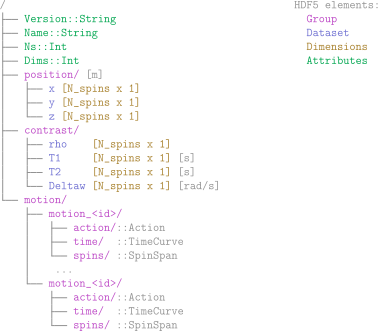
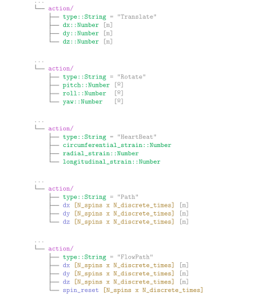
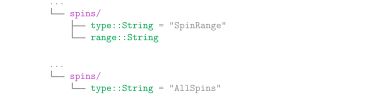

# Phantom File Format

## Introduction

While there is already an open and fairly standardised format for MRI sequences 
such as [Pulseq](https://pulseq.github.io/index.html), this is not the case for digital phantoms.
That's why we defined a new `.phantom` format, which relies on the [HDF5 standard](https://www.hdfgroup.org/solutions/hdf5/).
HDF5 is specially designed to store large amounts of heterogeneous data and to make it readable 
and writable quickly and easily. In addition, it allows the storage of metadata. 
For all these reasons, it is the ideal file format for storing phantoms.

## Phantom File I/O 
The **KomaMRIFiles** module provides two key functions for working with `.phantom` files:

- `read_phantom` loads a `.phantom` and converts it into a [`Phantom`](../reference/2-koma-base.md#KomaMRIBase.Phantom) instance.
- `write_phantom` converts a [`Phantom`](../reference/2-koma-base.md#KomaMRIBase.Phantom) instance into an HDF5-based `.phantom` file.

## File Format Specification

This section describes the internal structure of the `.phantom` file. While most users will interact with phantoms via the KomaMRI tools, this section is intended for developers who wish to implement support for the format in other applications or workflows.

### Phantom File Tree

```@raw html
<p></p>
```

### Action types

```@raw html
<p></p>
```

### TimeCurve

```@raw html
<p></p>
```

### SpinSpan types

```@raw html
<p></p>
```