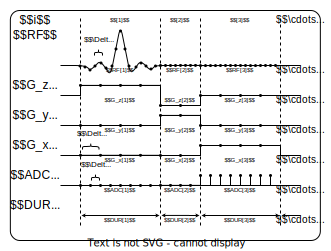

# Sequence

This section delves into some details about how a sequence is constructed. The sequence definition in **KomaMRI** is strongly related to the [Pulseq](https://pulseq.github.io/index.html) definition. After reading this section, you should be able to create your own **Sequence** structs for conducting custom simulations using the **KomaMRI** package.

## KomaMRI Sequence Overview

Let's introduce the following simple sequence figure to expand from a visual example to a more general sequence definition:
```@raw html
<p align="center"></p>
```

A **sequence** can be thought of as an ordered concatenation of blocks over time. Each block is essentially a sequence with a length of 1. Every block consists of an **RF** pulse, the ``(x,y,z)`` **gradients**, and the **acquisition** of samples. Each block also has an associated time **duration**. To simplify, we will refer to these components as follows:

```math
\begin{matrix*}[l]
\text{seq[i]}      &: & \text{block i of the sequence} \\
\text{seq.RF[i]}   &: & \text{RF pulse at the i block} \\
\text{seq.GR.x[i]} &: & \text{gradient x at the i block} \\
\text{seq.GR.y[i]} &: & \text{gradient y at the i block} \\
\text{seq.GR.z[i]} &: & \text{gradient z at the i block} \\
\text{seq.ADC[i]}  &: & \text{acquisition at the i block} \\
\text{seq.DUR[i]}  &: & \text{duration at the i block}
\end{matrix*}
```

A **Sequence** stores one column per block. Its main fields are:

| Field | Meaning |
|---|---|
| `GR` | Gradient events. Rows are the `x`, `y`, and `z` axes; columns are blocks. |
| `RF` | RF events. Rows are RF channels; columns are blocks. |
| `ADC` | ADC event for each block. |
| `DUR` | Duration of each block in seconds. |
| `EXT` | Pulseq extensions for each block, such as labels, triggers, or rotations. |
| `DEF` | Dictionary of sequence definitions, mostly used for file I/O and reconstruction metadata. |

The **RF**, **Grad**, and **ADC** events are explained in [Sequence Events](5-seq-events.md).

!!! warning
    So far, **KomaMRI** can only manage one coil for RF excitations. However, in future versions, parallel transmit pTX will be managed by adding more ``rows'' to the RF matrix of the Sequence field name.

In order to understand how a **Sequence** struct can be manipulated in **Julia**, let's use the EPI sequence example. You can display basic information of the **Sequence** variable in the **Julia REPL**:
```julia-repl
julia> seq = PulseDesigner.EPI_example()
Sequence[ τ = 62.846 ms | blocks: 204 | ADC: 101 | GR: 205 | RF: 1 | EXT: 0 | DEF: 16 ]
```

As you can see, this **Sequence** has 204 blocks, 1 of these blocks has an **RF** struct with values different from zero, there are 205 number of **Grad** structs considering the x-y-z components, 101 **ADC** structs acquire samples of some blocks and 62.846 ms is the total time duration of the complete **Sequence**.

To display the sequence in an graph, we can use the [`plot_seq`](@ref) function:
```julia-repl
julia> plot_seq(seq; slider=false)
```
```@raw html
<object type="text/html" data="../assets/seq-epi-example-full.html" style="width:100%; height:420px;"></object>
```

This way, you can see exactly where the **RF**, **Grad** and **ADC** structs are located in time.

You can access and filter information for the **RF**, **Grad**, **ADC**, and **DUR** field names of a **Sequence** using the dot notation. This allows you to display helpful information about the organization of the **Sequence** struct:
```julia-repl
julia> seq.RF
1×204 Matrix{RF}:
 ⊓(0.5872 ms)  ⇿(0.0 ms)  ⇿(0.0 ms)  …  ⇿(0.0 ms)  ⇿(0.0 ms)   

julia> seq.GR
3×204 Matrix{Grad}:
 ⇿(0.5872 ms)  ⊓(0.4042 ms)  ⊓(0.4042 ms)  …  ⇿(0.2062 ms)  ⊓(0.4042 ms)  ⊓(0.4042 ms)
 ⇿(0.5872 ms)  ⊓(0.4042 ms)  ⇿(0.4042 ms)     ⊓(0.2062 ms)  ⇿(0.4042 ms)  ⊓(0.4042 ms)
 ⇿(0.5872 ms)  ⇿(0.0 ms)     ⇿(0.0 ms)        ⇿(0.0 ms)     ⇿(0.0 ms)     ⇿(0.0 ms)

julia> seq.ADC
204-element Vector{ADC}:
 ADC(0, 0.0, 0.0, 0.0, 0.0)
 ADC(0, 0.0, 0.0, 0.0, 0.0)
 ADC(101, 0.00019999999999999998, 0.00010211565434713023, 0.0, 0.0)
 ⋮
 ADC(101, 0.00019999999999999998, 0.00010211565434713023, 0.0, 0.0)
 ADC(0, 0.0, 0.0, 0.0, 0.0)

julia> seq.DUR
204-element Vector{Float64}:
 0.0005871650124959989
 0.0004042313086942605
 0.0004042313086942605
 ⋮
 0.0004042313086942605
 0.0004042313086942605
```

Additionally, you can access a subset of blocks in a **Sequence** by slicing or indexing. The result will also be a **Sequence** struct, allowing you to perform the same operations as you would with a full Sequence (just a heads-up: this is analogous for the [Phantom](1-phantom.md) structure). For example, if you want to analyze the first 11 blocks, you can do the following:
```julia-repl
julia> seq[1:11]
Sequence[ τ = 3.837 ms | blocks: 11 | ADC: 5 | GR: 11 | RF: 1 | EXT: 0 | DEF: 16 ]

julia> seq[1:11].GR
3×11 Matrix{Grad}:
 ⇿(0.5872 ms)  ⊓(0.4042 ms)  ⊓(0.4042 ms)   …  ⊓(0.4042 ms)  ⇿(0.2062 ms)  ⊓(0.4042 ms)
 ⇿(0.5872 ms)  ⊓(0.4042 ms)  ⇿(0.4042 ms)      ⇿(0.4042 ms)  ⊓(0.2062 ms)  ⇿(0.4042 ms)
 ⇿(0.5872 ms)  ⇿(0.0 ms)     ⇿(0.0 ms)        ⇿(0.0 ms)     ⇿(0.0 ms)     ⇿(0.0 ms)

julia> plot_seq(seq[1:11]; slider=false)
```
```@raw html
<object type="text/html" data="../assets/seq-epi-example-some-blocks.html" style="width:100%; height:420px;"></object>
```

## Concatenation of Sequences 

Sequences can be concatenated side by side. The example below demonstrates how to concatenate sequences:
```julia-repl
julia> s = PulseDesigner.EPI_example()[1:11]
Sequence[ τ = 3.837 ms | blocks: 11 | ADC: 5 | GR: 11 | RF: 1 | EXT: 0 | DEF: 16 ]

julia> seq = s + s + s
Sequence[ τ = 11.512 ms | blocks: 33 | ADC: 15 | GR: 33 | RF: 3 | EXT: 0 | DEF: 16 ]

julia> plot_seq(seq; slider=false)
```
```@raw html
<object type="text/html" data="../assets/seq-concatenation.html" style="width:100%; height:420px;"></object>
```

The `+` operator returns a copied sequence, so reused sequence parts do not share
mutable events. For long construction loops, use [`@addblocks`](../how-to/3-create-your-own-sequence.md#add-blocks-in-loops)
to append efficiently.
