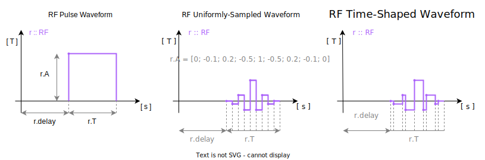
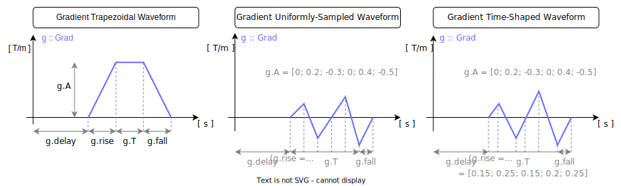
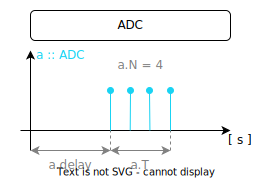

# Sequence Events

A `Sequence` is made from RF, gradient, ADC, and extension events. This page
shows the event shapes KomaMRI understands and how to place events into sequence
blocks.


## RF

An **RF** event stores the RF waveform and timing:

```julia
RF(A, T)
RF(A, T, Δf)
RF(A, T, Δf, delay; center, ϕ, use)
```

`A` is the complex RF amplitude in tesla, `T` is the waveform timing in seconds,
`delay` is the time from the block start to the first waveform sample, and `Δf`
is the frequency offset from the carrier. The keyword fields `center`, `ϕ`, and
`use` store Pulseq-compatible RF metadata.

`A` and `T` can be numbers or vectors. KomaMRI uses their shapes to choose the
waveform representation:

- Block pulse: `A` and `T` are numbers.
- Uniformly-sampled waveform: `A` is a vector and `T` is a number.
- Time-shaped waveform: `A` and `T` are both vectors; `T` stores interval
  durations, so `length(A) = length(T) + 1`.

In the image below, we provide a summary of how you can define **RF** events:

```@raw html
<p align="center"></p>
```

Let's look at some basic examples of creating these **RF** structs and including them in a **Sequence** struct. The examples should be self-explanatory.

### RF Pulse Waveform

```julia-repl
julia> A, T, delay =  10e-3, 0.5e-3, 0.1e-3;

julia> rf = RF(A, T, 0, delay)
←0.1 ms→ RF(10000.0 uT, 0.5 ms, 0.0 Hz)

julia> seq = Sequence(); @addblock seq += rf
Sequence[ τ = 0.6 ms | blocks: 1 | ADC: 0 | GR: 0 | RF: 1 | EXT: 0 | DEF: 11 ]

julia> plot_seq(seq; slider=false)
```
```@raw html
<object type="text/html" data="../assets/event-rf-pulse-waveform.html" style="width:100%; height:420px;"></object>
```

### RF Uniformly-Sampled Waveform

```julia-repl
julia> tl = -3:0.2:-0.2; tr = 0.2:0.2:3;

julia> A = (10e-3)*[sin.(π*tl)./(π*tl); 1; sin.(π*tr)./(π*tr)];

julia> T, delay = 0.5e-3, 0.1e-3;

julia> rf = RF(A, T, 0, delay)
←0.1 ms→ RF(∿ uT, 0.5 ms, 0.0 Hz)

julia> seq = Sequence(); @addblock seq += rf
Sequence[ τ = 0.6 ms | blocks: 1 | ADC: 0 | GR: 0 | RF: 1 | EXT: 0 | DEF: 11 ]

julia> plot_seq(seq; slider=false)
```
```@raw html
<object type="text/html" data="../assets/event-rf-uniformly-sampled-waveform.html" style="width:100%; height:420px;"></object>
```

### RF Time-Shaped Waveform

```julia-repl
julia> tl = -4:0.2:-0.2; tr = 0.2:0.2:4

julia> A = (10e-3)*[sin.(π*tl)./(π*tl); 1; 1; sin.(π*tr)./(π*tr)]

julia> T = [0.05e-3*ones(length(tl)); 2e-3; 0.05e-3*ones(length(tl))]

julia> delay = 0.1e-3;

julia> rf = RF(A, T, 0, delay)
←0.1 ms→ RF(∿ uT, 4.0 ms, 0.0 Hz)

julia> seq = Sequence(); @addblock seq += rf
Sequence[ τ = 4.1 ms | blocks: 1 | ADC: 0 | GR: 0 | RF: 1 | EXT: 0 | DEF: 11 ]

julia> plot_seq(seq; slider=false)
```
```@raw html
<object type="text/html" data="../assets/event-rf-time-shaped-waveform.html" style="width:100%; height:420px;"></object>
```


## Gradient

Gradient events are axis-neutral until they are added to a sequence block:

```julia
Grad(A, T)
Grad(A, T, rise)
Grad(A, T, rise, delay)
Grad(A, T, rise, fall, delay)
```

`A` is the gradient amplitude in T/m, `T` is the waveform timing in seconds,
`delay` is the time from the block start to the first waveform sample, and
`rise`/`fall` are the ramp durations. Choose the gradient axis with `x=`, `y=`,
or `z=` when adding the block.

As with RF events, `A` and `T` can be numbers or vectors:

- Trapezoid: `A` and `T` are numbers.
- Uniformly-sampled waveform: `A` is a vector and `T` is a number.
- Time-shaped waveform: `A` and `T` are both vectors; `T` stores interval
  durations, so `length(A) = length(T) + 1`.

In the image below, we provide a summary of how you can define **Grad** events:

```@raw html
<p align="center"></p>
```

Let's look at some basic examples of creating these **Grad** structs and including them in a **Sequence** struct, focusing on the `x` component of the gradients. The examples should be self-explanatory.

### Gradient Trapezoidal Waveform

```julia-repl
julia> A, T, delay, rise, fall = 50*10e-6, 5e-3, 2e-3, 1e-3, 1e-3;

julia> gr = Grad(A, T, rise, fall, delay)
←2.0 ms→ Grad(0.5 mT, 0.5 ms, ↑1.0 ms, ↓1.0 ms)

julia> seq = Sequence(); @addblock seq += (x=gr)
Sequence[ τ = 9.0 ms | blocks: 1 | ADC: 0 | GR: 1 | RF: 0 | EXT: 0 | DEF: 11 ]

julia> plot_seq(seq; slider=false)
```
```@raw html
<object type="text/html" data="../assets/event-gr-trapezoidal-waveform.html" style="width:100%; height:420px;"></object>
```

### Gradient Uniformly-Sampled Waveform

```julia-repl
julia> t = 0:0.25:7.5

julia> A = 10*10e-6 * sqrt.(π*t) .* sin.(π*t)

julia> T = 10e-3;

julia> delay, rise, fall = 1e-3, 0, 1e-3;

julia> gr = Grad(A, T, rise, fall, delay)
←1.0 ms→ Grad(∿ mT, 10.0 ms, ↑0.0 ms, ↓1.0 ms)

julia> seq = Sequence(); @addblock seq += (x=gr)
Sequence[ τ = 12.0 ms | blocks: 1 | ADC: 0 | GR: 1 | RF: 0 | EXT: 0 | DEF: 11 ]

julia> plot_seq(seq; slider=false)
```
```@raw html
<object type="text/html" data="../assets/event-gr-uniformly-sampled-waveform.html" style="width:100%; height:420px;"></object>
```

### Gradient Time-Shaped Waveform

```julia-repl
julia> A = 50*10e-6*[1; 1; 0.8; 0.8; 1; 1];

julia> T = 1e-3*[5; 0.2; 5; 0.2; 5];

julia> delay, rise, fall = 1e-3, 1e-3, 1e-3;

julia> gr = Grad(A, T, rise, fall, delay)
←1.0 ms→ Grad(∿ mT, 15.4 ms, ↑1.0 ms, ↓1.0 ms)

julia> seq = Sequence(); @addblock seq += (x=gr)
Sequence[ τ = 18.4 ms | blocks: 1 | ADC: 0 | GR: 1 | RF: 0 | EXT: 0 | DEF: 11 ]

julia> plot_seq(seq; slider=false)
```
```@raw html
<object type="text/html" data="../assets/event-gr-time-shaped-waveform.html" style="width:100%; height:420px;"></object>
```

## ADC

An **ADC** event stores sample count, acquisition timing, and optional phase
metadata:

```julia
ADC(N, T)
ADC(N, T, delay)
ADC(N, T, delay, Δf, ϕ)
```

`N` is the number of samples, `T` is the time from the first to the last sample,
and `delay` is the time from the block start to the first sample. `Δf` and `ϕ`
are used for frequency and phase compensation.

In the image below you can see how to define an **ADC** event:

```@raw html
<p align="center"></p>
```

Let's look at a basic example of defining an **ADC** struct and including it in a **Sequence** struct:
```julia-repl
julia> N, T, delay =  16, 5e-3, 1e-3;

julia> adc = ADC(N, T, delay)
ADC(16, 0.005, 0.001, 0.0, 0.0)

julia> seq = Sequence(); @addblock seq += adc
Sequence[ τ = 6.0 ms | blocks: 1 | ADC: 1 | GR: 0 | RF: 0 | EXT: 0 | DEF: 11 ]

julia> plot_seq(seq; slider=false)
```
```@raw html
<object type="text/html" data="../assets/event-adc.html" style="width:100%; height:420px;"></object>
```
## Extensions and Labels

The `EXT` field stores Pulseq extensions for each sequence block. Labels are the
most common extension: they mark metadata such as line number, echo number, or
slice number for reconstruction.


### LabelInc and LabelSet extension

`LabelInc` and `LabelSet` create label extensions that can be added to a block
with `@addblock`.

KomaMRI supports the Pulseq label names used by MATLAB Pulseq: counters `LIN`,
`PAR`, `SLC`, `SEG`, `REP`, `AVG`, `SET`, `ECO`, `PHS`, `ACQ`, and `TRID`; flags
`NAV`, `REV`, `SMS`, `REF`, `IMA`, `OFF`, and `NOISE`; and controls `PMC`,
`NOROT`, `NOPOS`, `NOSCL`, and `ONCE`. [MRD also stores other FLAGS currently
not available in KomaMRI](https://ismrmrd.readthedocs.io/en/stable/mrd_raw_data.html#mrd-acquisitionflags).

#### LabelInc

The `LabelInc` function creates a label that increments a specific metadata field by a given value. This is useful for managing fields like line numbers or echo numbers.

```julia
LabelInc(value::Int, label::String)
```

- `value`: The increment value.
- `label`: The name of the metadata field to increment.

#### LabelSet

The `LabelSet` function creates a label that sets a specific metadata field to a given value. This is useful for managing fields like line numbers or echo numbers.

```julia
LabelSet(value::Int, label::String)
```

- `value`: The value to set.
- `label`: The name of the metadata field to set.

### Trigger extension

As described by the [Pulseq specifications](https://pulseq.github.io/specification.pdf) : `TRIGGERS extension, which
is not a part of the core Pulseq format and MAY be subject to rapid changes`. The usage of the type / channel is system dependent and must be checked beforehand.

!!! note
    Trigger extension is implemented but currently not taken into account during the simulation 

```julia
Trigger(type, channel, delay, duration)
```

`type` and `channel` are system dependent. `delay` is the delay before the
trigger event in seconds, and `duration` is the trigger duration in seconds.

### Rotation extension

`QuaternionRot(q0, qx, qy, qz)` stores a Pulseq `ROTATIONS` extension. `read_seq`
applies these rotations to the gradients by default and keeps the extension
events in `seq.EXT`, so writing the sequence can preserve the Pulseq rotation
extension. Use `read_seq(filename; apply_rotations=false)` to keep the gradients
as stored in the file.
On write, KomaMRI inverse-rotates the gradients before serializing the extension,
so reading the exported file with default settings recovers the same gradient
waveforms.

### Example Usage

Below is an example of adding labels and a trigger to sequence blocks:

```julia
seq = Sequence()

lInc = LabelInc(1, "LIN")
lSet = LabelSet(1, "ECO")
trig = Trigger(0, 1, 100e-6, 500e-6) # delay and duration in seconds

@addblock seq += (ADC(16, 5e-3), lInc, trig)
@addblock seq += (ADC(16, 5e-3), lSet)
```

`LabelInc(1, "LIN")` increments the line number by 1, and `LabelSet(1, "ECO")`
sets the echo number to 1. The trigger delay and duration are specified in
seconds in KomaMRI.

### Combining Labels

You can combine multiple extensions in a single block by passing them together:

```julia
seq = Sequence()

lInc = LabelInc(1, "LIN")
lSet = LabelSet(1, "ECO")

@addblock seq += (ADC(16, 5e-3), lInc, lSet)
```

Both labels are stored in the `EXT` entry for that block.

!!! warning
    KomaMRI currently supports Pulseq labels, triggers, and rotations. Other Pulseq
    extensions can be added later as needed.

## Combination of Events

Multiple events can be placed in the same sequence block. RF, ADC, and
extensions are positional; gradients use `x=`, `y=`, or `z=`.

```julia
# Define an RF struct
A, T =  1e-6*[0; -0.1; 0.2; -0.5; 1; -0.5; 0.2; -0.1; 0], 0.5e-3;
rf = RF(A, T)

# Define a Grad struct for Gx
A, T, rise =  50*10e-6, 5e-3, 1e-3
gx = Grad(A, T, rise)

# Define a Grad struct for Gy
A = 50*10e-6*[0; 0.5; 0.9; 1; 0.9; 0.5; 0; -0.5; -0.9; -1]
T, rise = 5e-3, 2e-3;
gy = Grad(A, T, rise)

# Define a Grad struct for Gz
A = 50*10e-6*[0; 0.5; 0.9; 1; 0.9; 0.5; 0; -0.5; -0.9; -1]
T = 5e-3*[0.0; 0.1; 0.3; 0.2; 0.1; 0.2; 0.3; 0.2; 0.1]
gz = Grad(A, T)

# Define an ADC struct
N, T, delay =  16, 5e-3, 1e-3
adc = ADC(N, T, delay)
```
```julia-repl
julia> seq = Sequence(); @addblock seq += (rf, adc, x=gx, y=gy, z=gz)
Sequence[ τ = 9.0 ms | blocks: 1 | ADC: 1 | GR: 3 | RF: 1 | EXT: 0 | DEF: 11 ]

julia> plot_seq(seq; slider=false)
```
```@raw html
<object type="text/html" data="../assets/event-combination.html" style="width:100%; height:420px;"></object>
```

The lower-level [`Sequence`](@ref KomaMRIBase.Sequence) constructor also accepts
event matrices, but `@addblock` is usually clearer when writing pulse programs.


## Algebraic manipulation

Mathematical operations can be applied to events and sequences. This is useful
when constructing reusable events or chunks and then scaling, phase-shifting, or
rotating them.

* RF scaling
```julia
# Define params
A, T = 10e-6, 0.5e-3    # Define base RF params  
α = (1 + im*1)/sqrt(2)  # Define a complex scaling factor

# Create two equivalent RFs in different ways
ra = RF(α * A, T)
rb = α * RF(A, T)
```
```julia-repl
julia> ra ≈ rb
true
```

* Gradient scaling
```julia
# Define params
A, T = 10e-3, 0.5e-3   # Define base gradient params  
α = 2                  # Define a scaling factor

# Create two equivalent gradients in different ways
ga = Grad(α * A, T)
gb = α * Grad(A, T)
```
```julia-repl
julia> ga ≈ gb
true
```

* Gradient addition
```julia
# Define params
T = 0.5e-3      # Define common duration of the gradients
A1 = 5e-3       # Define base amplitude for gradient  
A2 = 10e-3      # Define another base amplitude for gradient  

# Create two equivalent gradients in different ways
ga = Grad(A1 + A2, T)
gb = Grad(A1, T) + Grad(A2, T)
```
```julia-repl
julia> ga ≈ gb
true
```

* Gradient array multiplication by a matrix
```julia
# Define params
T = 0.5e-3                          # Define common duration of the gradients
Ax, Ay, Az = 10e-3, 20e-3, 5e-3     # Define base amplitude for gradients  
gx, gy, gz = Grad(Ax, T), Grad(Ay, T), Grad(Az, T)  # Define gradients
R = [0 1. 0; 0 0 1.; 1. 0 0]        # Define matrix (a rotation matrix in this example)

# Create two equivalent gradient vectors in different ways
ga = [gy; gz; gx]
gb = R * [gx; gy; gz]

# Create two equivalent gradient matrices in different ways
gc = [gy 2*gy; gz 2*gz; gx 2*gx]
gd = R * [gx 2*gx; gy 2*gy; gz 2*gz]
```
```julia-repl
julia> all(ga .≈ gb)
true

julia> all(gc .≈ gd)
true
```

* Sequence rotation
```julia
# Define params
T = 0.5e-3                          # Define common duration of the gradients
Ax, Ay, Az = 10e-3, 20e-3, 5e-3     # Define base amplitude for gradients  
gx, gy, gz = Grad(Ax, T), Grad(Ay, T), Grad(Az, T)  # Define gradients
R = [0 1. 0; 0 0 1.; 1. 0 0]        # Define matrix (a rotation matrix in this example)

# Create two equivalent sequences in different ways
sa = Sequence()
s = Sequence()
@addblock sa += (x=gy, y=gz, z=gx)
@addblock s += (x=gx, y=gy, z=gz)
sb = R * s
```
```julia-repl
julia> all(sa.GR .≈ sb.GR)
true
```

Real scaling and matrix multiplication affect gradients. Complex scaling affects
RF and ADC phase, leaving gradients unchanged.
