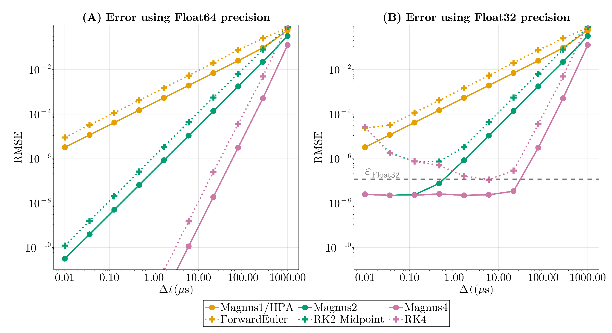
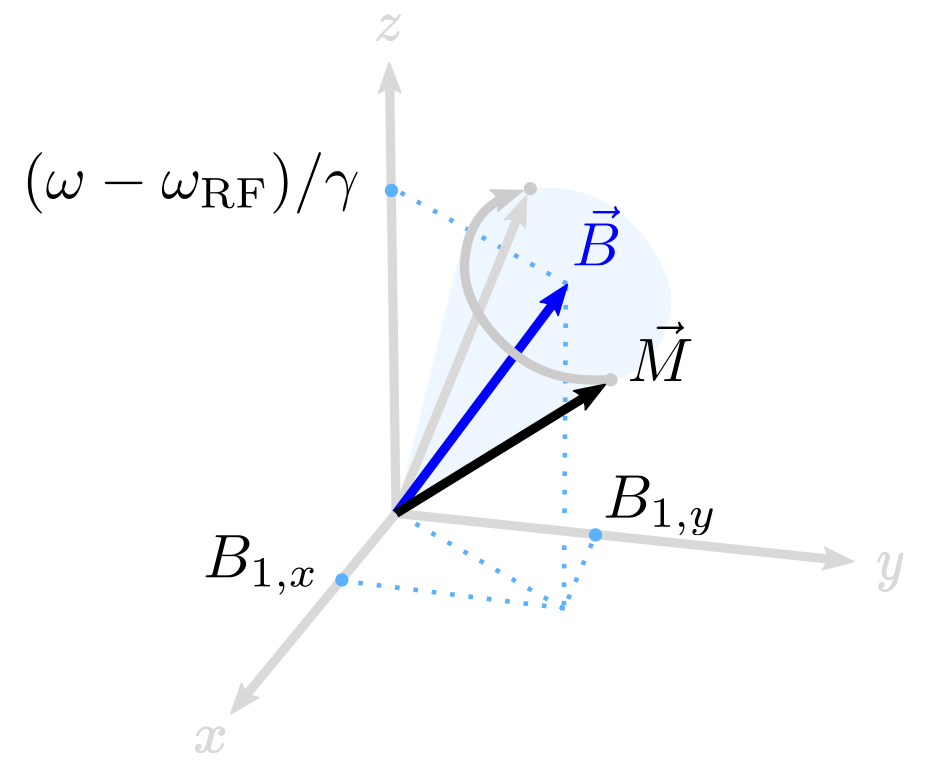

# Magnus Bloch Methods

Magnus methods are RF-excitation solvers that keep each time step as a rotation.
They are useful when RF, gradients, or off-resonance change during a time step:
you can either use a larger ``\Delta t`` for speed, or keep the same
``\Delta t`` and reduce time-discretization error.

KomaMRI provides three Magnus variants:

| Method | Field model inside one time step | Practical use |
|:---|:---|:---|
| `BlochMagnus1()` | piecewise constant | hard-pulse approximation / baseline |
| `BlochMagnus2()` | piecewise linear average field | good default for smooth RF excitation |
| `BlochMagnus4()` | piecewise linear plus commutator correction | higher accuracy at larger ``\Delta t`` |

Use them through `sim_params["sim_method"]`:

```julia
sim_params = KomaMRICore.default_sim_params()
sim_params["sim_method"] = BlochMagnus2()
sim_params["Δt_rf"] = 8e-6
raw = simulate(obj, seq, sys; sim_params)
```

## Accuracy And Step Size

The practical benefit is that higher-order Magnus methods can either improve RF
excitation accuracy at the same ``\Delta t``, or reach similar accuracy with a
larger ``\Delta t``.

```@raw html
<p align="center">
  
</p>
```

The convergence behavior follows the expected order: first, second, and fourth
order for `BlochMagnus1()`, `BlochMagnus2()`, and `BlochMagnus4()`. In
`Float64`, the higher-order methods keep improving as ``\Delta t`` becomes
smaller until other errors dominate. In `Float32`, the error eventually reaches
roundoff limits, so decreasing ``\Delta t`` indefinitely is not always useful.

## Effective Field Vector

Let ``\boldsymbol{B}(t)`` be the effective field in the RF rotating frame,
including RF frequency modulation. In angular-frequency units,

```math
\boldsymbol{\omega}(t) = -\gamma \boldsymbol{B}(t) \:.
```

```@raw html
<p align="center">
  
</p>
```

Here ``\boldsymbol{B}(t)`` combines the transverse RF components
``B_{1,x}`` and ``B_{1,y}`` with the longitudinal frequency-offset term
``(\omega - \omega_{\mathrm{RF}})/\gamma``.

For one excitation step from ``t_n`` to ``t_{n+1}``, define
``\boldsymbol{\omega}_n = \boldsymbol{\omega}(t_n)`` and
``\boldsymbol{\omega}_{n+1} = \boldsymbol{\omega}(t_{n+1})``. The Magnus update
is still a rotation:

```math
\boldsymbol{M}_{n+1} =
\exp\left([\boldsymbol{\theta}]_\times\right) \boldsymbol{M}_n \:,
```

where ``[\cdot]_\times`` is the cross-product matrix. By truncating the Magnus
expansion and assuming the field is constant or linear during the step, KomaMRI
uses the following rotation vectors:

```math
\begin{aligned}
\boldsymbol{\theta}_{\mathrm{Magnus1}} &= \Delta t\,\boldsymbol{\omega}_n \\
\boldsymbol{\theta}_{\mathrm{Magnus2}} &= \frac{\Delta t}{2}
  \left(\boldsymbol{\omega}_n + \boldsymbol{\omega}_{n+1}\right) \\
\boldsymbol{\theta}_{\mathrm{Magnus4}} &=
  \boldsymbol{\theta}_{\mathrm{Magnus2}}
  + \frac{\Delta t^2}{12}
    \left(\boldsymbol{\omega}_{n+1} \times \boldsymbol{\omega}_n\right) \:.
\end{aligned}
```

The Magnus rotation vector ``\boldsymbol{\theta}`` produces a rotation around
``\hat{\boldsymbol{n}}`` with angle ``\theta``:

```math
\exp\left([\boldsymbol{\theta}]_\times\right)
=
R_{\hat{\boldsymbol{n}}}(\theta),
\quad
\hat{\boldsymbol{n}} =
\frac{\boldsymbol{\theta}}{\lVert\boldsymbol{\theta}\rVert},
\quad
\theta = \lVert\boldsymbol{\theta}\rVert \:.
```

The implementation computes ``\boldsymbol{\theta}`` directly. See
[`effective_rotation_vector!`](https://github.com/JuliaHealth/KomaMRI.jl/blob/master/KomaMRICore/src/simulation/SimMethods/BlochMagnus/cpu/BlochMagnusCPU.jl)
for CPU and
[`effective_rotation_vector`](https://github.com/JuliaHealth/KomaMRI.jl/blob/master/KomaMRICore/src/simulation/SimMethods/BlochMagnus/gpu/BlochMagnusGPU.jl)
for GPU kernels.
