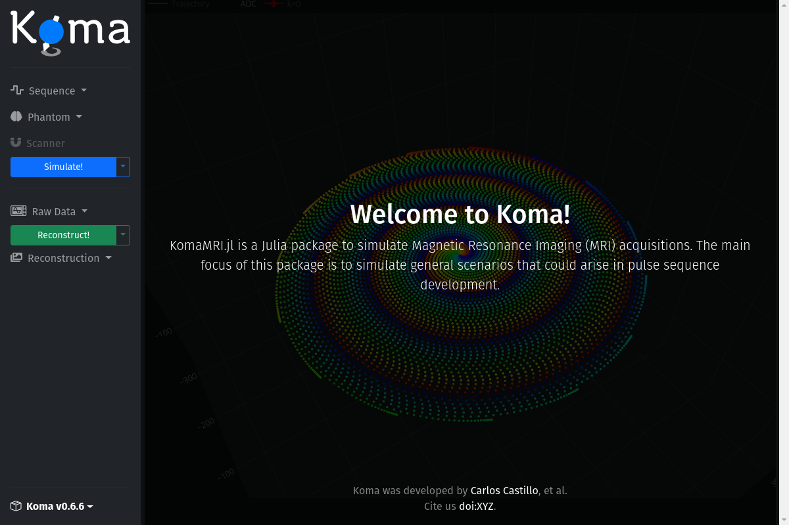
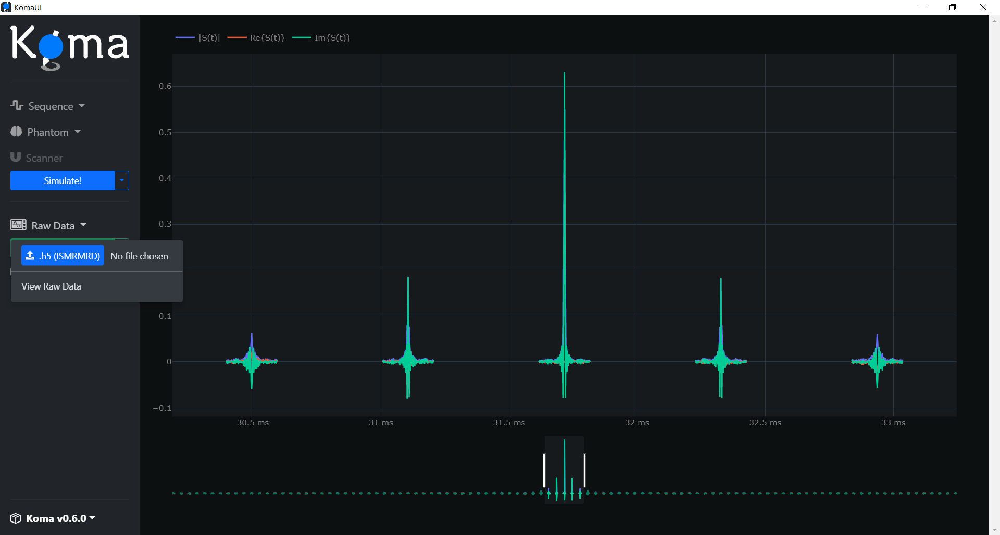
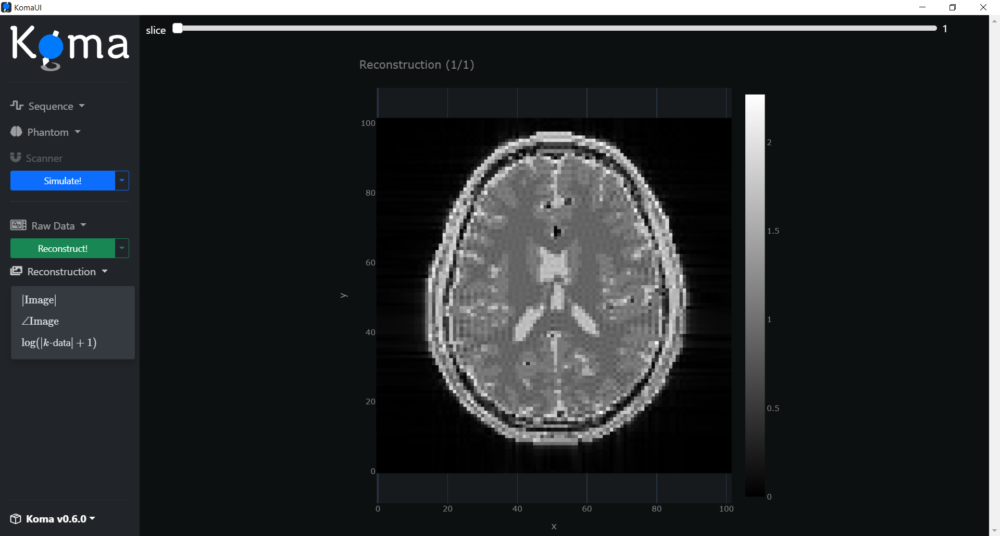

# Getting Started

## Installing Julia

KomaMRI was written in Julia, so the first thing you should do is to install it! The latest version of Julia can be downloaded at the [Julia Downloads](https://julialang.org/downloads/) page. It is advisable you add julia to the PATH, which can be done during the installation process.

## Installing KomaMRI

Once Julia is installed, open the Julia REPL and add the `KomaMRI` package. To bring up Julia's [package manager](https://docs.julialang.org/en/v1/stdlib/Pkg/) enter `]`, and then add the KomaMRI package. This process should take about 5 minutes in a fresh Julia installation. 

```julia-repl
julia> ]

(@v1.8) pkg> add KomaMRI
```

**IMPORTANT!!!** After Julia 1.9 release, some features don't work properly when using multithreading with the user interface. By the time being, the following workaround is necessary to solve some errors:
```julia
(@v1.9) pkg> add WebIO#a18e830a5a4d1193472e2a111ca4a62c1165f716
```

Then press `Ctrl+C` or `backspace` to return to the `julia>` prompt.


---
## My First MRI Simulation

For our first simulation we will use Koma's graphical user interface (GUI). For this, you will first need to load KomaMRI by typing `using KomaMRI`, and then lauch the GUI with `KomaUI()`.

```julia-repl
julia> using KomaMRI

julia> KomaUI()
```
The first time you use this command it may take more time than usual, but a window with the Koma GUI will pop up:



The user interface has some basic definitions for the scanner, phantom, and sequence already preloaded. So you can immediately interact with the simulation and reconstruction processes, and then visualize the results.

As a simple demonstration, press the button `Simulate!` and wait until the simulation is ready. Then click on the `Raw Data` dropdown and then click on the `View Raw Data` button. You should see the following:



Then, press the button `Reconstruct!` and wait until the reconstruction ends. Then click on the `Reconstruction` dropdown and then click on the `|Image|` button to see the image reconstruction: 



Congratulations, you successfully simulated an MRI acquisition! 🎊