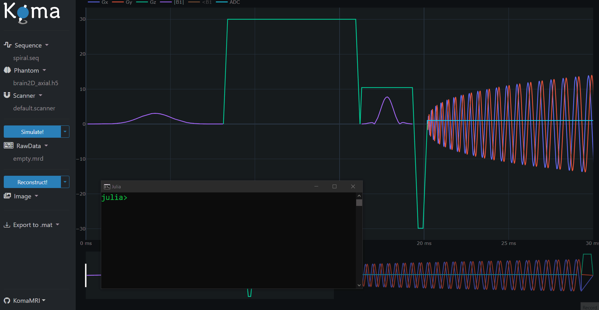

# Use Koma's User Interface

This section provides a comprehensive guide on using the **User Interface** of the **KomaMRI** package and delves into the internal processes that occur during interaction. By the end of this section, you will be equipped to execute a complete workflow even without any prior programming experience.

```@raw html
<p align="center"></p>
```


## Basic Workflow
(You can also go to [analog steps using Scripts](1-3-use-koma-scripts.md#Basic-Workflow))

As a general overview, remember the following workflow steps when using KomaMRI:

* Loading Simulation Inputs: **Scanner**, **Phantom**, **Sequence**
* Running Simulation
* Reconstructing Image using **MRIReco**

In the following subsections, we will cover all the mentioned steps. First, open the **Julia REPL** and enter the following commands to include the **KomaMRI** package and launch the user interface:
```julia-repl
julia> using KomaMRI

julia> KomaUI()
```
After installing the [`koma` app](1-4-use-koma-cli.md#Installing-the-App) (Julia 1.12+), the same interface can be opened from the terminal:
```bash
koma
```
```@raw html
<p align="center"></p>
```

## Loading Simulation Inputs
(You can also go to [analog steps using Scripts](1-3-use-koma-scripts.md#Loading-Simulation-Inputs))

The user interface has preloaded certain inputs into RAM, including the **Scanner**, **Phantom**, and **Sequence** structs. In the following subsections, we will demonstrate how to visualize these inputs.

### Scanner

You can visualize the preloaded **Scanner** struct by clicking on the `Scanner` dropdown and then pressing the `View Scanner` button. The **Scanner** struct contains hardware-related information, such as the main magnetic field's magnitude:
```@raw html
<p align="center"></p>
```

### Phantom

To see the phantom already stored in RAM, simply click on the `Phantom` dropdown an then press the `View Phantom` button. The preloaded phantom is a slice of a brain:
```@raw html
<p align="center"></p>
```

It is also possible to load `.h5` phantom files. The **KomaMRI.jl** has some examples stored at `~/.julia/packages/KomaMRI/<id-string>/examples/2.phantoms/`. For instance, let's load the `sphere_chemical_shift.h5` file:
```@raw html
<p align="center"></p>
```

Note that you can select different spin parameters to visualize like `ρ`, `T1`, `T2`, among others. 

### Sequence

There are two options to visualize the sequence already preloaded in RAM: in the time domain or in the k-space. The preloaded sequence is a single-shot EPI.

For visualization of the sequence in the time domain, click on the `Sequence` dropdown and then press the `Sequence (MPS)` button:
```@raw html
<p align="center"></p>
```

For visualization of the sequence in the k-space, click on the `Sequence` dropdown and then press the `k-space` button:
```@raw html
<p align="center"></p>
```

You can also display the `Moments` related to the **Sequence** by pressing the `View Moments` and then pressing the buttons for zero, first and second moments.

It is also possible to load **Pulseq** compatible `.seq` sequence files. The **KomaMRI** has some examples stored at `~/.julia/packages/KomaMRI/<id-string>/examples/1.sequences/`. For instance, let's load the `spiral.seq` file and view it the time domain and k-space:
```@raw html
<p align="center"></p>
```
```@raw html
<p align="center"></p>
```

And remember, you are free to interact with the plots:
```@raw html
<p align="center"></p>
```


## Running Simulation
(You can also go to [analog steps using Scripts](1-3-use-koma-scripts.md#Running-Simulation))

Once the inputs are loaded in RAM, it is possible to perform the simulation to get the **Raw Signal**.

### Simulation Parameters

To visualize the default simulation parameters, click on the `Simulate!` dropdown and then press the `View Options` button:
```@raw html
<p align="center"></p>
```

### Visualization of the Raw Signal

Press the `Simulate!` button to perform the simulation (this may take a while). Automatically the generated **Raw Signal** should be displayed or you can click on the `Raw Data` dropdown and then press the `View Raw Data` button:
```@raw html
<p align="center"></p>
```

## Reconstructing Image using MRIReco
(You can also go to [analog steps using Scripts](1-3-use-koma-scripts.md#Reconstructing-Image-using-MRIReco))

Once the **Raw Signal** is loaded in RAM, it is possible to reconstruct the image.

### Reconstruction Parameters

To visualize the default reconstruction parameters, click on the `Reconstruct!` dropdown and then press the `View Options` button:
```@raw html
<p align="center"></p>
```

### Visualization of the Image

Press the `Reconstruct!` button to perform the reconstruction (this may take a while).  Automatically the generated **Image** should be displayed or you can click on the he `Reconstruct!` dropdown and then press the `|Image|` button:
```@raw html
<p align="center"></p>
```

## Exporting Results to .mat File

(You can also go to [analog steps using Scripts](1-3-use-koma-scripts.md#Exporting-Results-to-.mat-File))

Choose a result from `Export to .mat`, or choose `All`, then select the output folder.
The confirmation shows the saved filenames. The examples below use the individual exports
`data_raw.mat`, `data_sequence.mat`, and `data_image.mat`; `All` uses `raw.mat`,
`seq_sequence.mat`, and `image.mat` for those results.

```@raw html
<p align="center"></p>
```

**Format change:** `raw` is now a struct, replacing the old numeric `[time, signal]`
matrix. Label-aware image exports now contain a `reconstruction` struct instead of the
previous separate `image`, `labels`, `source_labels`, and `recon_policy` variables.
Plain-array image exports still contain the original `image` variable.

### Raw data

`raw.params` preserves the MRD metadata. `raw.profiles` is a cell array, with one struct
per acquired readout:

| Field | Contents |
| --- | --- |
| `head` | Full MRD acquisition header, including flags, timestamps, discard counts, and `idx` label counters |
| `traj` | Stored trajectory, coordinates × samples; normalization is unchanged |
| `data` | Complex signal, samples × receive coils |
| `role` | Acquisition role derived from the MRD flags, such as `imaging` or `navigator` |

Profiles retain their own sample counts and trajectory dimensions, so 1D navigators,
2D images, and 3D acquisitions can coexist. No coils are discarded, no `Inf` separators
are inserted, and timestamps are not synthesized. Koma's trajectory normalization scale
is retained in `raw.params.userParameters.KomaTrajectoryScale` when available.

Raw data also exports when `userParameters` is absent. When present, those parameters
are additionally saved in `sim_params.mat`. Dictionary keys replace `Δ` with `d` for
MATLAB compatibility, for example `Δt_rf` becomes `dt_rf`.

```matlab
s = load('data_raw.mat');
p = s.raw.profiles{1};
signal = p.data(:, 1);       % All samples from receive coil 1
k = p.traj;                 % Original stored coordinates for this readout
slice_label = p.head.idx.slice;
```

### Sequence

`sequence` retains the waveform fields `Gx`, `Gy`, `Gz`, `RF_AM`, `RF_FM`, and `ADCS`,
and adds `definitions` and `adc`. Each `sequence.adc` vector has one entry per ADC event:
`block` is the one-based Julia sequence-block index, `num_samples` is its sample count,
and `labels` contains named vectors of all accumulated ADC label values. Label values
are preserved, including zero; they are not converted to MATLAB indices.

```matlab
s = load('data_sequence.mat');
adc_blocks = s.sequence.adc.block;
repetitions = s.sequence.adc.labels.REP;
```

### Reconstructed images

`reconstruction.policy` records the reconstruction policy. Each cell in
`reconstruction.images` contains one reconstruction batch with `data`, `size`, `labels`,
and `source`. `labels` identifies the batch; `source` retains its original
acquisition counters. The six data dimensions are **x, y, z, echo, coil, repetition**.
The explicit six-element `size` vector preserves trailing singleton dimensions that
MATLAB does not display.

```matlab
s = load('data_image.mat');
batch = s.reconstruction.images{1};
I = reshape(batch.data, batch.size(:).');
echo = 1; coil = 1; repetition = 1; z = 1;
plane = I(:, :, z, echo, coil, repetition);
if batch.size(2) == 1 && batch.size(3) == 1
    plot(abs(plane(:, 1)));       % 1D reconstruction
else
    imagesc(abs(plane)); axis image; % 2D image or one plane of a 3D volume
end
volume = I(:, :, :, echo, coil, repetition);
```

Select a different batch for separate acquisition labels, such as `SLC` or `REP`.
Select `z` within a batch for a reconstructed 3D partition. MATLAB array indices are
one-based, independently of the stored label values. Explicit indexing above avoids
collapsing coil or echo dimensions with `squeeze`.

Profile and image collections remain cell arrays even with one element, for a
consistent format across supported MAT.jl versions 0.10, 0.11, and 0.12.


## REPL and UI communication

An amazing feature of **KomaMRI** is that it allows you to modify certain variables in the **Julia REPL**, and then the user interface automatically updates its plots in real-time:

```@raw html
<p align="center"></p>
```

The variables that update the interface are:

* `seq_ui[]` for the **Sequence**
* `obj_ui[]` for the **Phantom**
* `sys_ui[]` for the **Scanner**
* `physio_ui[]` for the **Physiological Signal**
* `raw_ui[]` for the **Raw Signal**
* `img_ui[]` for the **Image**

Don't forget to add the brackets `[]` to these variables, otherwise it won't work.
Changing `seq_ui[]` resets `physio_ui[]` to the sequence's default physiological signal.
