# Use Koma's User Interface

This section provides a comprehensive guide on using the **User Interface** of the **KomaMRI** package and delves into the internal processes that occur during interaction. By the end of this section, you will be equipped to execute a complete workflow even without any prior programming experience.

```@raw html
<p align="center">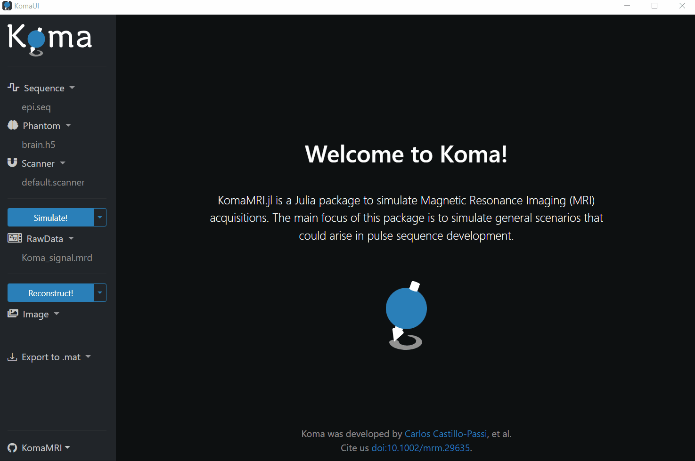</p>
```


## Basic Workflow
(You can also go to [analog steps using Scripts](1-3-use-koma-scripts.md#Basic-Workflow))

As a general overview, remember the following workflow steps when using KomaMRI:

* Loading Simulation Inputs: **Scanner**, **Phantom**, **Sequence**
* Running Simulation
* Reconstructing Image using **MRIReco**

In the following subsections, we will cover all the mentioned steps. First, open the **Julia REPL** and enter the following commands to include the **KomaMRI** package and launch the user interface:
```julia-repl
julia> using KomaMRI

julia> KomaUI()
```
After installing the [`koma` app](1-4-use-koma-cli.md#Installing-the-App) (Julia 1.12+), the same interface can be opened from the terminal:
```bash
koma
```
```@raw html
<p align="center">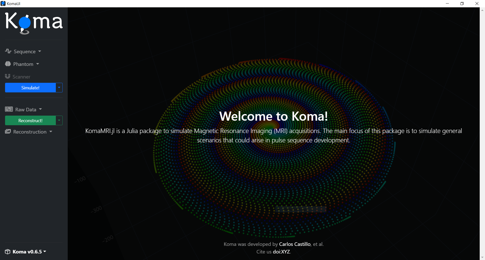</p>
```

## Loading Simulation Inputs
(You can also go to [analog steps using Scripts](1-3-use-koma-scripts.md#Loading-Simulation-Inputs))

The user interface has preloaded certain inputs into RAM, including the **Scanner**, **Phantom**, and **Sequence** structs. In the following subsections, we will demonstrate how to visualize these inputs.

### Scanner

Use the Scanner file picker to load a `.sys` file; the reload button reads it again.
See the [scanner file reference](../reference/4-koma-files.md#Scanner) for creating files and supported models.

Select `View limits` for hardware limits or `View coil sensitivities` for receive maps.
`View gradients` and `View B₁ maps` are not yet available and are disabled.
```@raw html
<p align="center">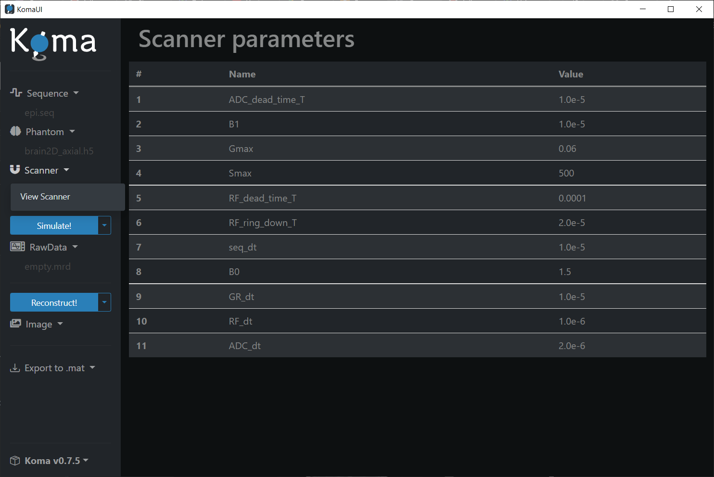</p>
```

### Phantom

To see the phantom already stored in RAM, simply click on the `Phantom` dropdown an then press the `View phantom` button. The preloaded phantom is a slice of a brain:
```@raw html
<p align="center">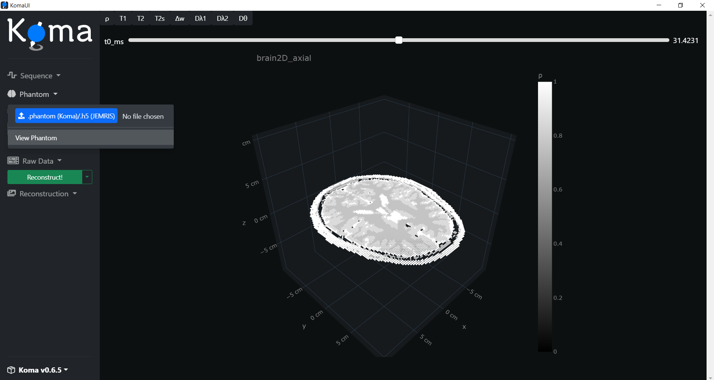</p>
```

For moving phantoms, select `|v|`, `vx`, `vy`, or `vz` to color spins in cm/s. Signed components
use blue/white/red for negative/zero/positive with fixed symmetric limits over time.
Magenta marks exit before a reset; cyan marks re-entry after it. Reset jumps are
excluded from the velocity scale.
Property buttons share one plot, preserving camera and time. Use ▶/❚❚ beside the
time slider for a five-second loop; playback skips display frames when needed,
but every time step remains selectable. Dragging the slider pauses playback.
Motion previews sample visible spins; zooming concentrates detail in that region.
The percentage reports visible spins shown; stopping restores spatial detail.

It is also possible to load `.h5` phantom files. The **KomaMRI.jl** has some examples stored at `~/.julia/packages/KomaMRI/<id-string>/examples/2.phantoms/`. For instance, let's load the `sphere_chemical_shift.h5` file:
```@raw html
<p align="center">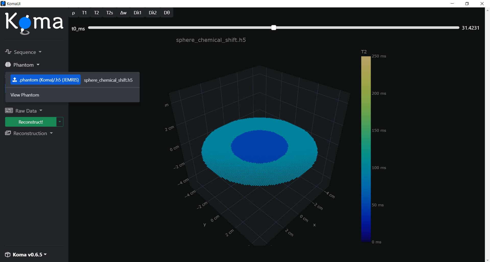</p>
```

Note that you can select different spin parameters to visualize like `ρ`, `T1`, `T2`, among others. 

### Sequence

There are two options to visualize the sequence already preloaded in RAM: in the time domain or in the k-space. The preloaded sequence is a single-shot EPI.

For visualization of the sequence in the time domain, click on the `Sequence` dropdown and then press the `Sequence (MPS)` button:
```@raw html
<p align="center">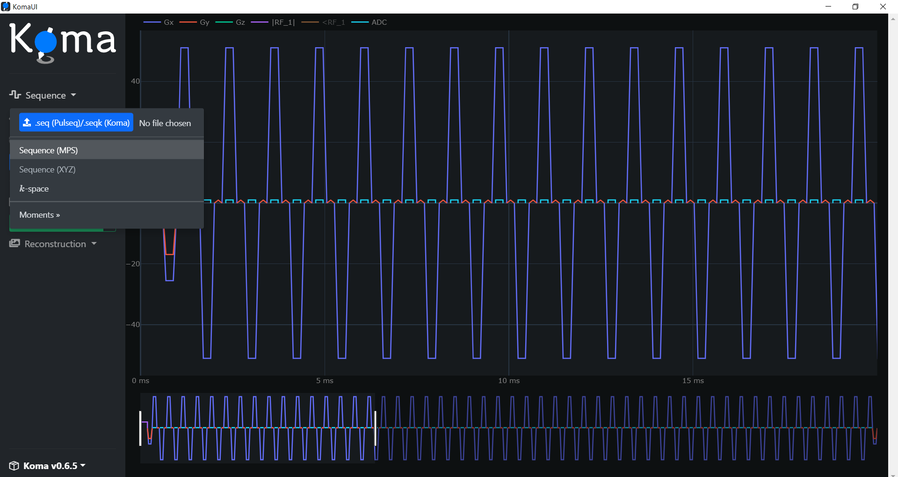</p>
```

For visualization of the sequence in the k-space, click on the `Sequence` dropdown and then press the `k-space` button:
```@raw html
<p align="center">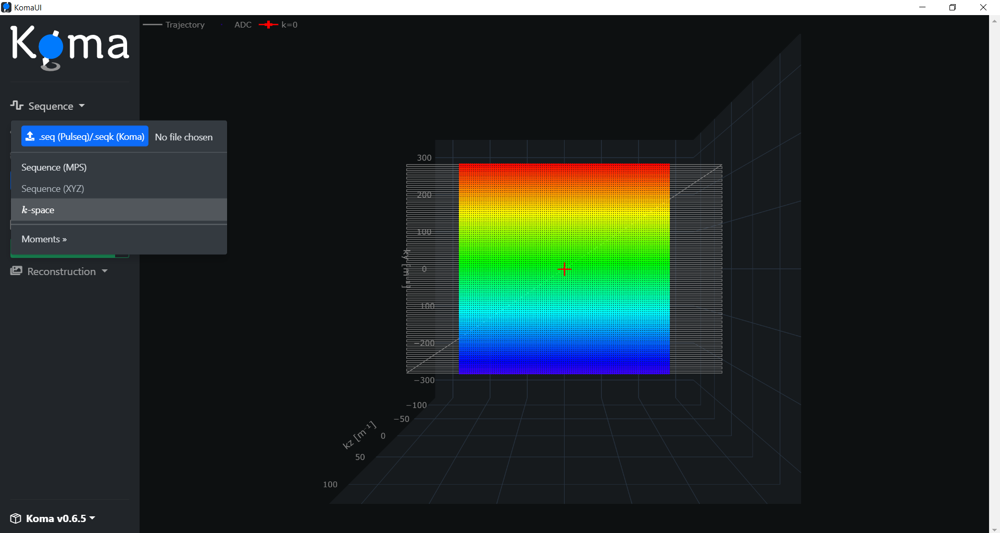</p>
```

You can also display the `Moments` related to the **Sequence** by pressing the `View moments` and then pressing the buttons for zero, first and second moments.

It is also possible to load **Pulseq** compatible `.seq` sequence files. The **KomaMRI** has some examples stored at `~/.julia/packages/KomaMRI/<id-string>/examples/1.sequences/`. For instance, let's load the `spiral.seq` file and view it the time domain and k-space:
```@raw html
<p align="center">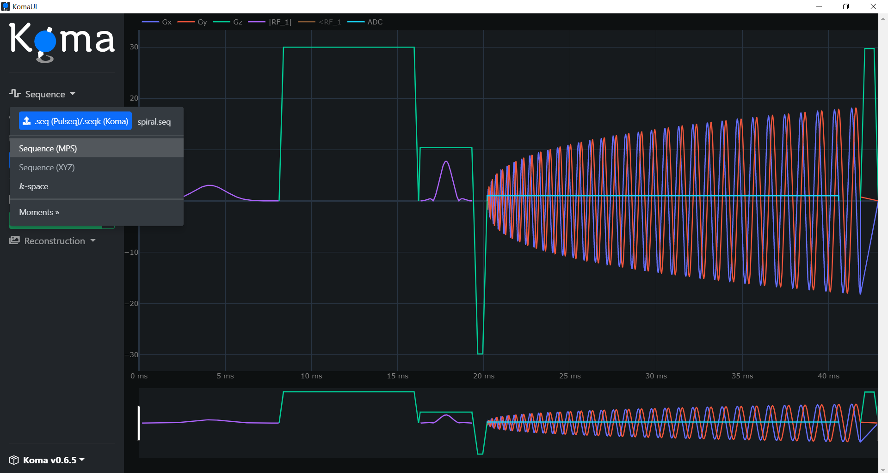</p>
```
```@raw html
<p align="center">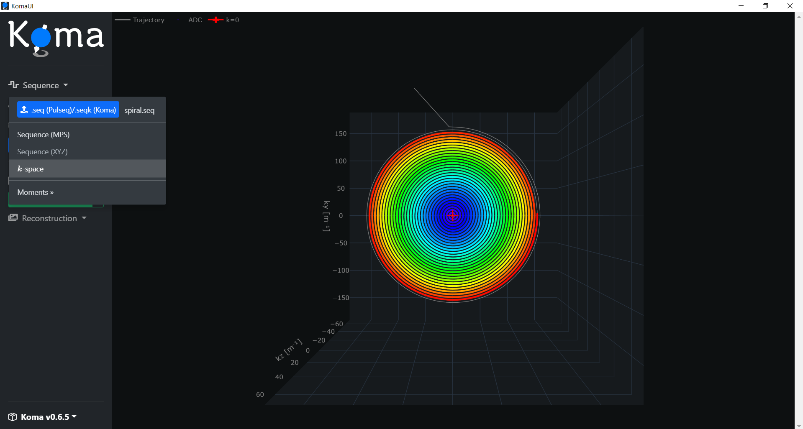</p>
```

And remember, you are free to interact with the plots:
```@raw html
<p align="center">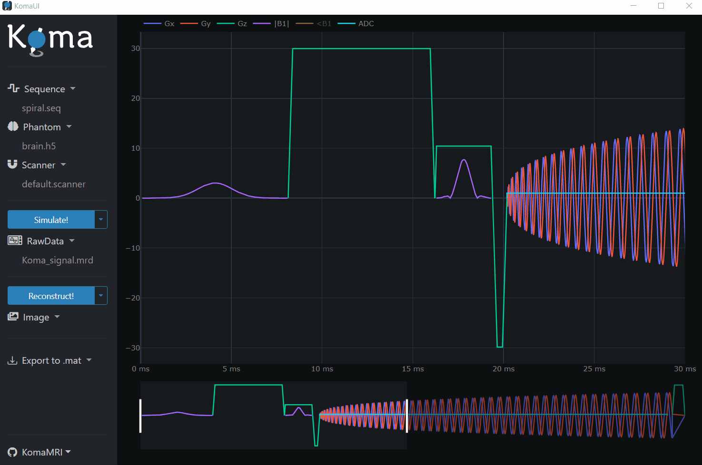</p>
```


## Running Simulation
(You can also go to [analog steps using Scripts](1-3-use-koma-scripts.md#Running-Simulation))

Once the inputs are loaded in RAM, it is possible to perform the simulation to get the **Raw Signal**.

### Simulation Parameters

To visualize the default simulation parameters, click on the `Simulate!` dropdown and then press the `View options` button:
```@raw html
<p align="center">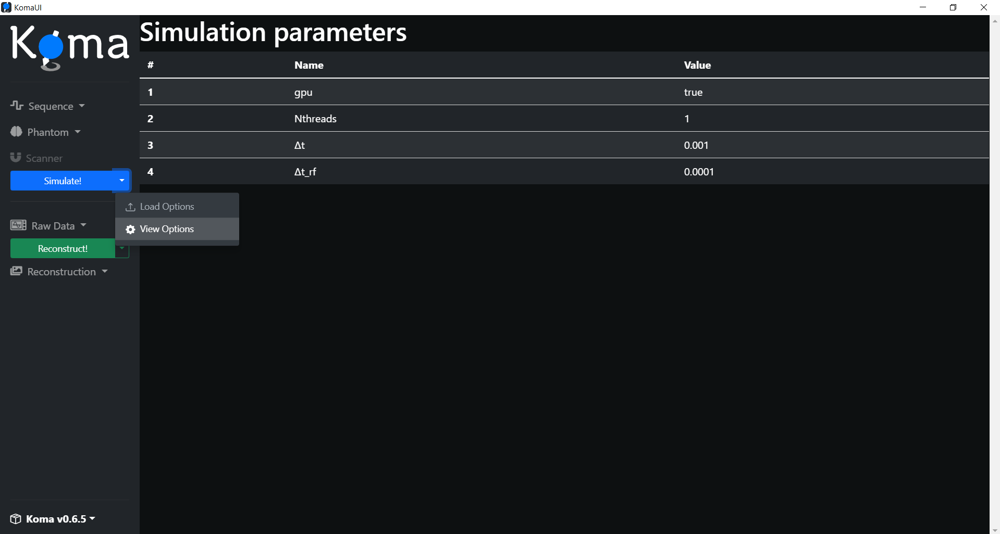</p>
```

### Visualization of the Raw Signal

Press the `Simulate!` button to perform the simulation (this may take a while). Automatically the generated **Raw Signal** should be displayed or you can click on the `Raw data` dropdown and then press the `View raw data` button:
```@raw html
<p align="center">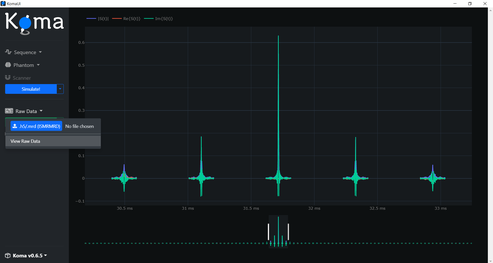</p>
```

## Reconstructing Image using MRIReco
(You can also go to [analog steps using Scripts](1-3-use-koma-scripts.md#Reconstructing-Image-using-MRIReco))

Once the **Raw Signal** is loaded in RAM, it is possible to reconstruct the image.

### Reconstruction Parameters

To visualize the default reconstruction parameters, click on the `Reconstruct!` dropdown and then press the `View options` button:
```@raw html
<p align="center">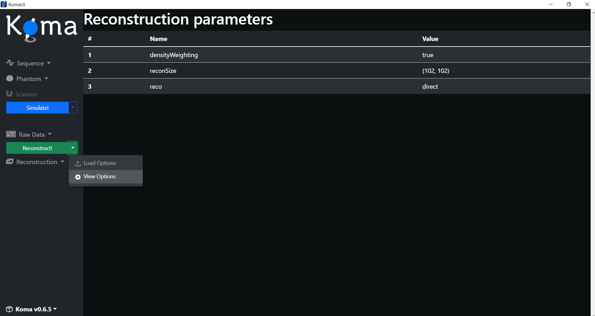</p>
```

### Visualization of the Image

Press the `Reconstruct!` button to perform the reconstruction (this may take a while).  Automatically the generated **Image** should be displayed or you can click on the he `Reconstruct!` dropdown and then press the `|Image|` button:
```@raw html
<p align="center">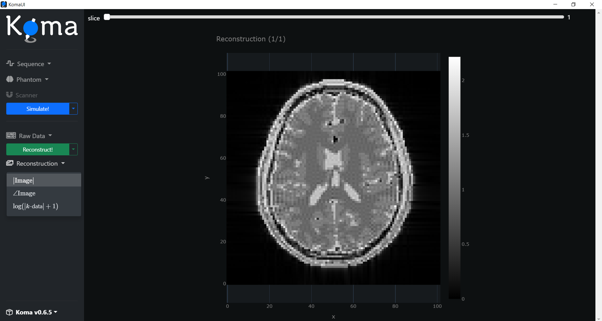</p>
```

## Exporting Results to .mat File

(You can also go to [analog steps using Scripts](1-3-use-koma-scripts.md#Exporting-Results-to-.mat-File))

Choose a result from `Export to .mat`, or choose `All`, then select the output folder.
The confirmation shows the saved filenames.

```@raw html
<p align="center">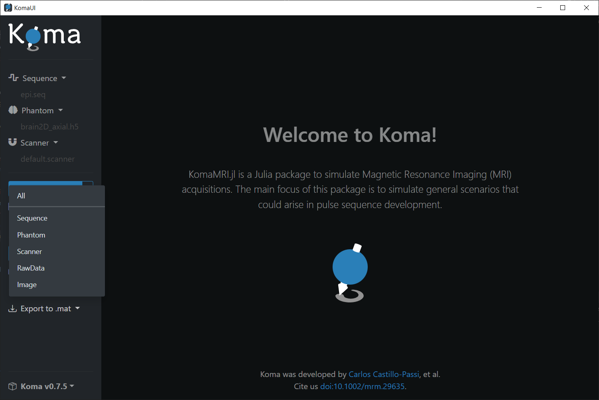</p>
```

See the [MATLAB export reference](../reference/4-koma-files.md#MATLAB-exports)
for filenames, struct fields, and MATLAB examples.

## Controlling the UI from Julia (easier for AI agents)

Load inputs, set options, then simulate and reconstruct:

```julia
w = KomaUI(; return_window=true)
load_file!(w, :sequence, "example.seq")   # Or: w.seq[] = seq
load_file!(w, :phantom, "brain.phantom")  # Or: w.obj[] = obj
load_file!(w, :scanner, "scanner.sys")    # Or: w.sys[] = sys
w.sim_params[] = merge(w.sim_params[], Dict("precision" => "f32"))
w.rec_params[] = merge(w.rec_params[], Dict(:reco => "standard", :iterations => 10))
click!(w, :simulate)
click!(w, :reconstruct)

# Other menu actions
click!(w, :view_kspace)
click!(w, :view_coil_sensitivities)
click!(w, :reload_sequence)
```

For GPU simulation, import the backend first, e.g. `using Metal` or `using CUDA`.
See the [full action list](../reference/6-koma-mri.md#Actions) (or `?click!` in Julia)
and [window data reference](../reference/6-koma-mri.md#Window-data).
