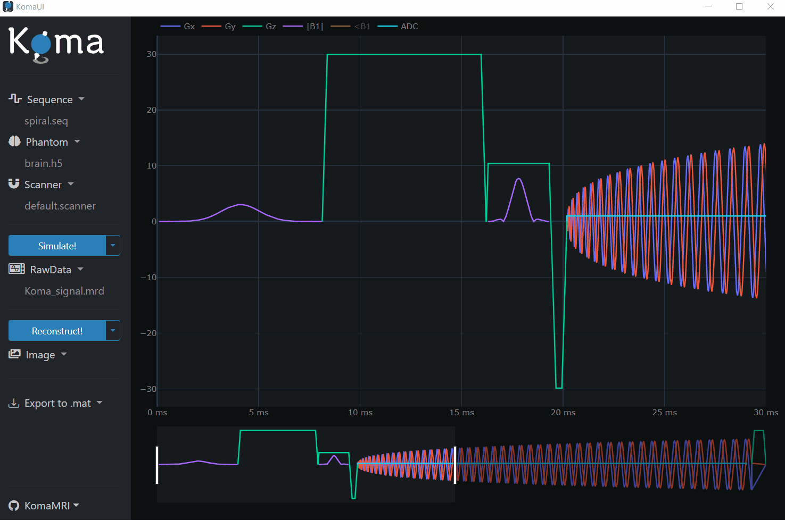
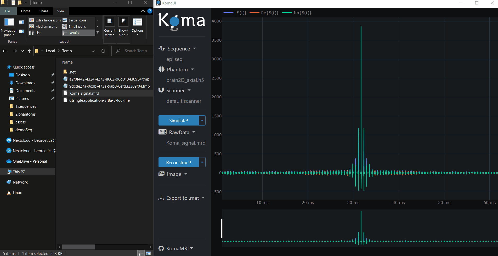
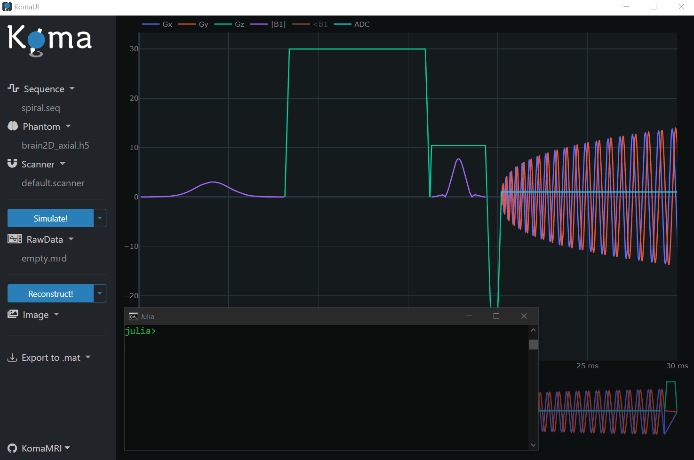

# Use Koma's User Interface

This section provides a comprehensive guide on using the **User Interface** of the **KomaMRI** package and delves into the internal processes that occur during interaction. By the end of this section, you will be equipped to execute a complete workflow even without any prior programming experience.

```@raw html
<p align="center"></p>
```


## Basic Workflow
(You can also go to [analog steps using Scripts](1-3-use-koma-scripts.md#Basic-Workflow))

As a general overview, remember the following workflow steps when using KomaMRI:

* Loading Simulation Inputs: **Scanner**, **Phantom**, **Sequence**
* Running Simulation
* Reconstructing Image using **MRIReco**

In the following subsections, we will cover all the mentioned steps. First, open the **Julia REPL** and enter the following commands to include the **KomaMRI** package and launch the user interface:
```julia-repl
julia> using KomaMRI

julia> KomaUI()
```
```@raw html
<p align="center"></p>
```

## Loading Simulation Inputs
(You can also go to [analog steps using Scripts](1-3-use-koma-scripts.md#Loading-Simulation-Inputs))

The user interface has preloaded certain inputs into RAM, including the **Scanner**, **Phantom**, and **Sequence** structs. In the following subsections, we will demonstrate how to visualize these inputs.

### Scanner

You can visualize the preloaded **Scanner** struct by clicking on the `Scanner` dropdown and then pressing the `View Scanner` button. The **Scanner** struct contains hardware-related information, such as the main magnetic field's magnitude:
```@raw html
<p align="center"></p>
```

### Phantom

To see the phantom already stored in RAM, simply click on the `Phantom` dropdown an then press the `View Phantom` button. The preloaded phantom is a slice of a brain:
```@raw html
<p align="center"></p>
```

It is also possible to load `.h5` phantom files. The **KomaMRI.jl** has some examples stored at `~/.julia/packages/KomaMRI/<id-string>/examples/2.phantoms/`. For instance, let's load the `sphere_chemical_shift.h5` file:
```@raw html
<p align="center"></p>
```

Note that you can select different spin parameters to visualize like `ρ`, `T1`, `T2`, among others. 

### Sequence

There are two options to visualize the sequence already preloaded in RAM: in the time domain or in the k-space. The preloaded sequence is a single-shot EPI.

For visualization of the sequence in the time domain, click on the `Sequence` dropdown and then press the `Sequence (MPS)` button:
```@raw html
<p align="center"></p>
```

For visualization of the sequence in the k-space, click on the `Sequence` dropdown and then press the `k-space` button:
```@raw html
<p align="center"></p>
```

You can also display the `Moments` related to the **Sequence** by pressing the `View Moments` and then pressing the buttons for zero, first and second moments.

It is also possible to load **Pulseq** compatible `.seq` sequence files. The **KomaMRI** has some examples stored at `~/.julia/packages/KomaMRI/<id-string>/examples/1.sequences/`. For instance, let's load the `spiral.seq` file and view it the time domain and k-space:
```@raw html
<p align="center"></p>
```
```@raw html
<p align="center"></p>
```

And remember, you are free to interact with the plots:
```@raw html
<p align="center"></p>
```


## Running Simulation
(You can also go to [analog steps using Scripts](1-3-use-koma-scripts.md#Running-Simulation))

Once the inputs are loaded in RAM, it is possible to perform the simulation to get the **Raw Signal**.

### Simulation Parameters

To visualize the default simulation parameters, click on the `Simulate!` dropdown and then press the `View Options` button:
```@raw html
<p align="center"></p>
```

### Visualization of the Raw Signal

Press the `Simulate!` button to perform the simulation (this may take a while). Automatically the generated **Raw Signal** should be displayed or you can click on the `Raw Data` dropdown and then press the `View Raw Data` button:
```@raw html
<p align="center"></p>
```

## Reconstructing Image using MRIReco
(You can also go to [analog steps using Scripts](1-3-use-koma-scripts.md#Reconstructing-Image-using-MRIReco))

Once the **Raw Signal** is loaded in RAM, it is possible to reconstruct the image.

### Reconstruction Parameters

To visualize the default reconstruction parameters, click on the `Reconstruct!` dropdown and then press the `View Options` button:
```@raw html
<p align="center"></p>
```

### Visualization of the Image

Press the `Reconstruct!` button to perform the reconstruction (this may take a while).  Automatically the generated **Image** should be displayed or you can click on the he `Reconstruct!` dropdown and then press the `|Image|` button:
```@raw html
<p align="center"></p>
```

## Exporting Results to .mat File
(You can also go to [analog steps using Scripts](1-3-use-koma-scripts.md#Exporting-Results-to-.mat-File))

The user interface has the option to save the results in `.mat` format. Simply click on the `Export to .mat` and you have the alternatives to get data independently or you can press the `All` button to have all the results given by the simulator:
```@raw html
<p align="center"></p>
```

So far, and due to limitations of the user interface dependencies, the `.mat` files are saved in the temporal directory of your computer OS, which can be found by typing the `tempdir()` command in the **Julia REPL**:
```@raw html
<p align="center"></p>
```


## REPL and UI communication

An amazing feature of **KomaMRI** is that it allows you to modify certain variables in the **Julia REPL**, and then the user interface automatically updates its plots in real-time:

```@raw html
<p align="center"></p>
```

The variables that update the interface are:

* `seq_ui[]` for the **Sequence**
* `obj_ui[]` for the **Phantom**
* `sys_ui[]` for the **Scanner**
* `raw_ui[]` for the **Raw Signal**
* `img_ui[]` for the **Image**

Don't forget to add the brackets `[]` to these variables, otherwise it won't work.

