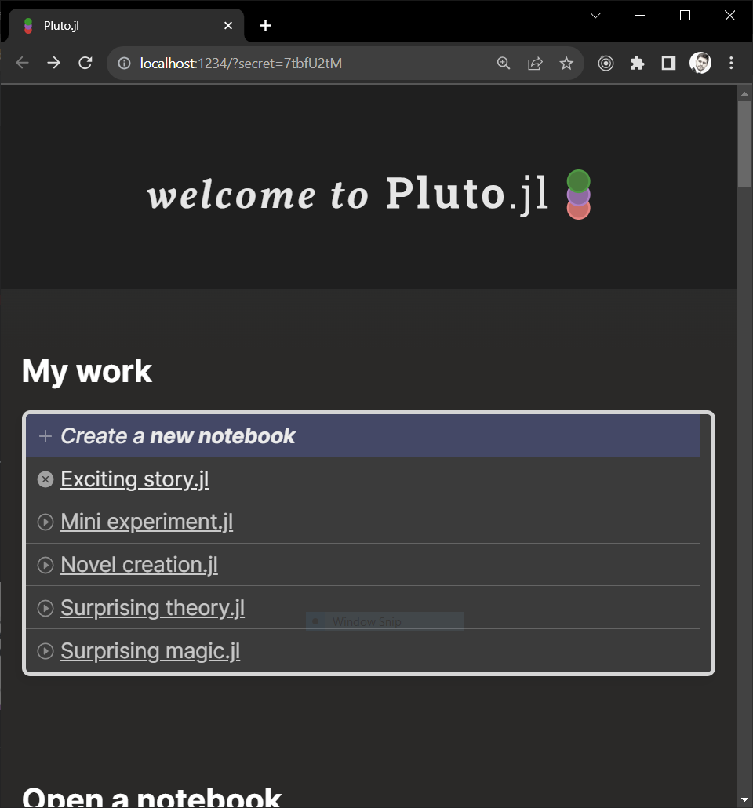
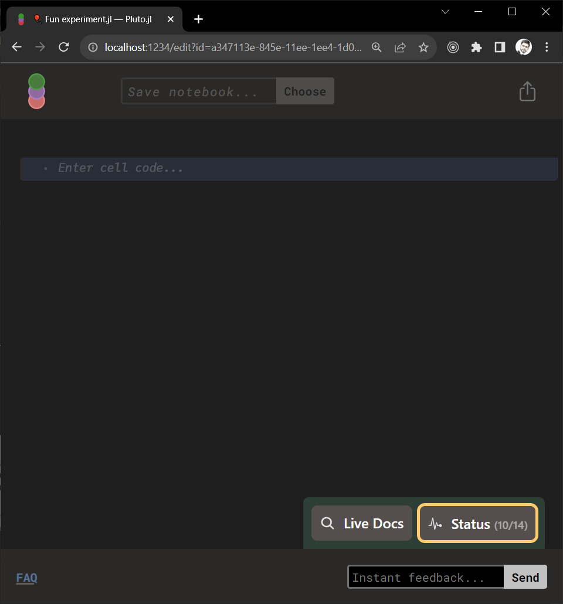
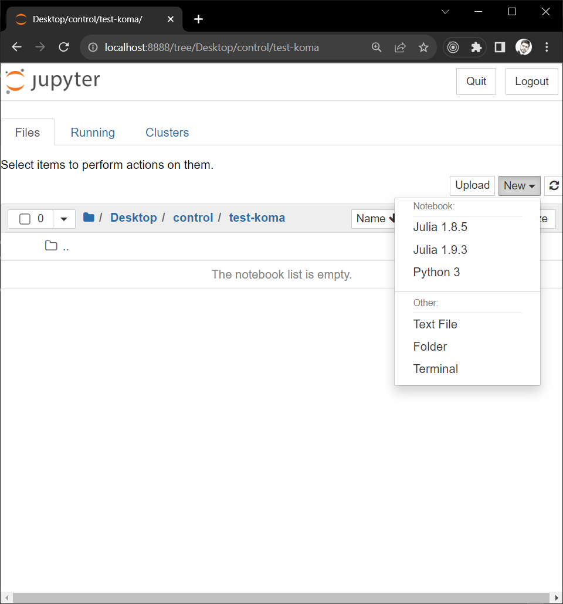
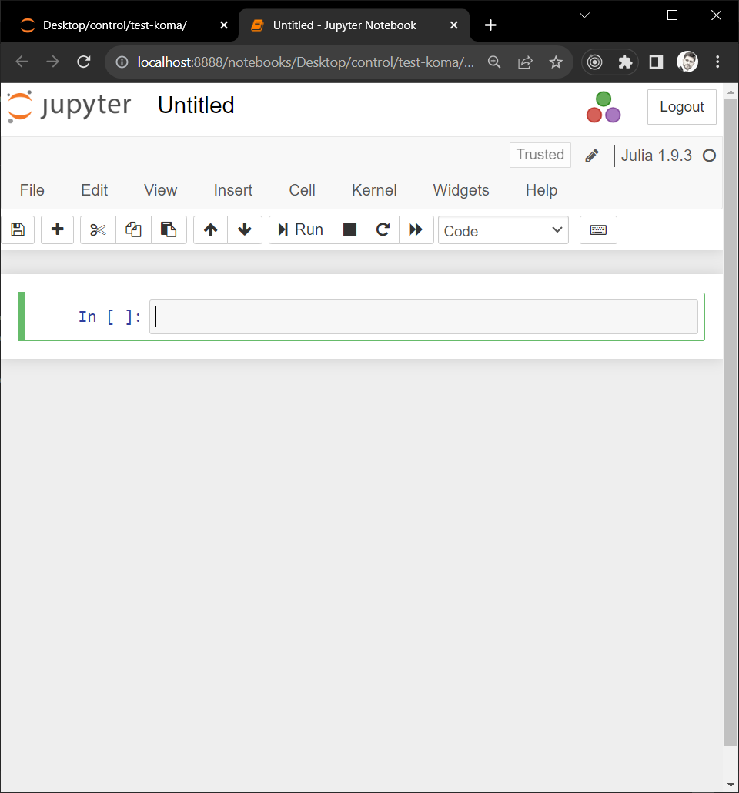
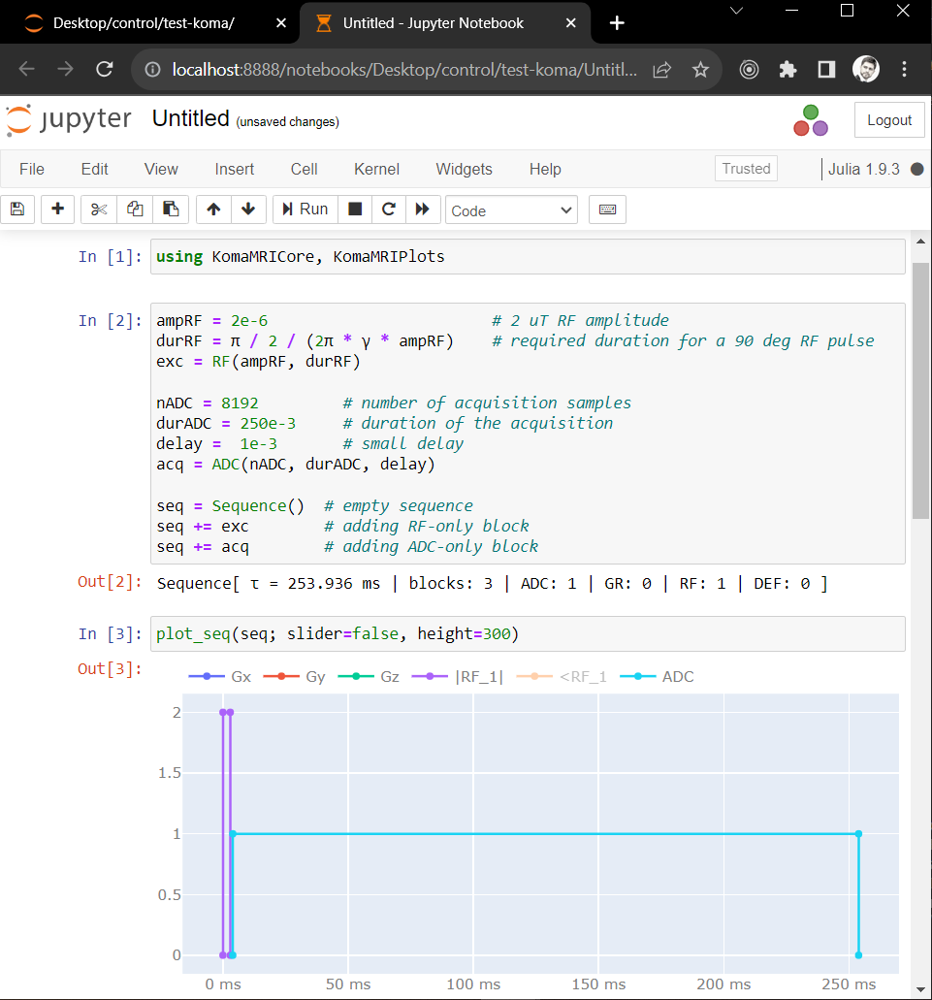
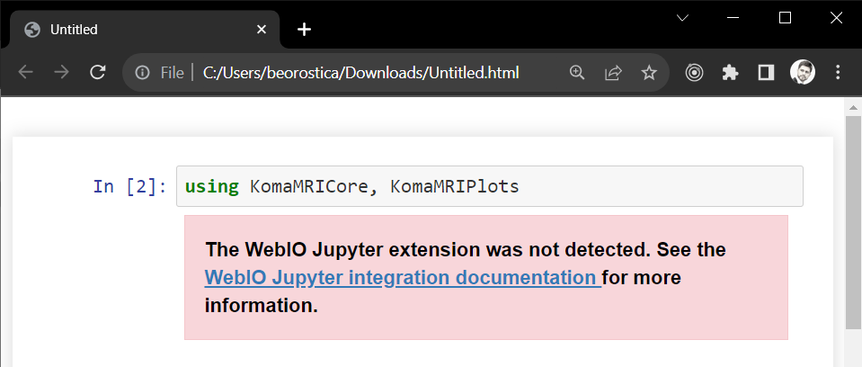

# Use Koma in Notebooks

You can use **KomaMRI** with popular programming environments such as **Pluto** and **Jupyter** notebooks. The following sections show how to set up these notebooks and test **KomaMRI** with them.


## Pluto

First, install the **Pluto** module in your **Julia** environment. Remember to press the `]` button to open the **Package Manager Session**:
```julia-repl
julia> ]

(@1.9) pkg> add Pluto
```

Afterward, return to the **Julia Session** by pressing the `backspace` button, and then execute the `Pluto.run()` function:
```julia-repl
julia> using Pluto

julia> Pluto.run()
```

This should automatically open the **Pluto** dashboard in your default web browser:
```@raw html
<center></center>
```

Next, create a new notebook by clicking on `+ Create a new notebook`:
```@raw html
<center></center>
```

Write and run the following code, which is identical to the [Free Induction Decay example](#Free-Induction-Decay). **Pluto** automatically installs the required modules if they are not present on your system. Additionally, note that we do not directly use **KomaMRI** since we won't be utilizing the [`KomaUI`](@ref) function. Instead, we rely on the **KomaMRICore** and **KomaMRIPlots** dependencies. To display plots in **Pluto**, ensure that you import the **PlutoPlotly** package, as **KomaMRIPlots** requires its backend to display figures in **Pluto**:
```@raw html
<embed type="text/html" src="../assets/pluto-fid-example.html" style="height:1024px;width:100%;">
```

One of the most outstanding features of **Pluto** is its ability to ensure reproducibility by storing the information necessary to recreate the package environment in the notebook file. When others open your notebook with Pluto, it automatically ensures they use the exact same package environment, guaranteeing seamless functionality on their computers.


## Jupyter

Ensure you have **Jupyter** installed on your computer. Follow [this tutorial](https://test-jupyter.readthedocs.io/en/latest/install.html) for installation using **Anaconda**.

Next, install the **IJulia** module in your **Julia** environment. Remember to press the `]` key to open the **Package Manager Session**:
```julia-repl
julia>

(@v1.9) pkg> add IJulia
```

For this example, make sure to install **KomaMRICore** and **KomaMRIPlots** (we do not use **KomaMRI** directly since we won't be utilizing the `KomaUI()` function):
```julia-repl
(@v1.9) pkg> add KomaMRICore

(@v1.9) pkg> add KomaMRIPlots
```

Next, open **Jupyter**, navigate to a working folder, and create a new notebook by clicking on `New`, then `Julia 1.9.3`."
```@raw html
<center></center>
```

A new, empty notebook will appear:
```@raw html
<center></center>
```

Proceed to write and execute the provided example:

```@raw html
<details><summary>View code</summary>
```
```julia
# Import modules
using KomaMRICore, KomaMRIPlots

# Define sequence
ampRF = 2e-6                        # 2 uT RF amplitude
durRF = π / 2 / (2π * γ * ampRF)    # required duration for a 90 deg RF pulse
exc = RF(ampRF, durRF)

nADC = 8192         # number of acquisition samples
durADC = 250e-3     # duration of the acquisition
delay =  1e-3       # small delay
acq = ADC(nADC, durADC, delay)

seq = Sequence()  # empty sequence
seq += exc        # adding RF-only block
seq += acq        # adding ADC-only block

# Plot the sequence
plot_seq(seq; slider=false, height=300)
```
```@raw html
</details>
```

```@raw html
<center></center>
```


This should be sufficient, and now you can start working with **KomaMRI** using **Jupyter** notebooks.

If you encounter the issue of **WebIO** not being detected:
```@raw html
<center></center>
```

Refer to [this IJulia documentation](https://juliagizmos.github.io/WebIO.jl/latest/providers/ijulia/) and [this troubleshooting guide](https://juliagizmos.github.io/WebIO.jl/stable/troubleshooting/not-detected/) for details. Essentially, you need to install a **WebIO** extension depending on your **Jupyter** installation.
