# Advanced Users

If you really want to stay in tune with the most recent features, test some ideas, or even contribute to the KomaMRI project, it is necessary to install and configure some tools on your machine:
- **Juliaup:** This is the manager for installing different versions of Julia.
- **Julia:** This is the programming language. It is advisable to install it with Juliaup.
- **Git:** This is a version control system handy for coding.
- **GitHub:** This is a cloud-based Git repository handy for managing the KomaMRI project. You need to create an account.
- **VScode:** This is a code editor with support for development operations.
- **VScode Plugins:** They enable VSCode to have more handy features. We recommend you install the following: "Julia", "Git Graph", "GitHub Pull Requests"."

## Setup your Fork of KomaMRI

Once everything is installed, you need to create a fork of the KomaMRI repository in your GitHub account. Go to the official [KomaMRI repository](https://github.com/JuliaHealth/KomaMRI.jl) and follow the steps below:"

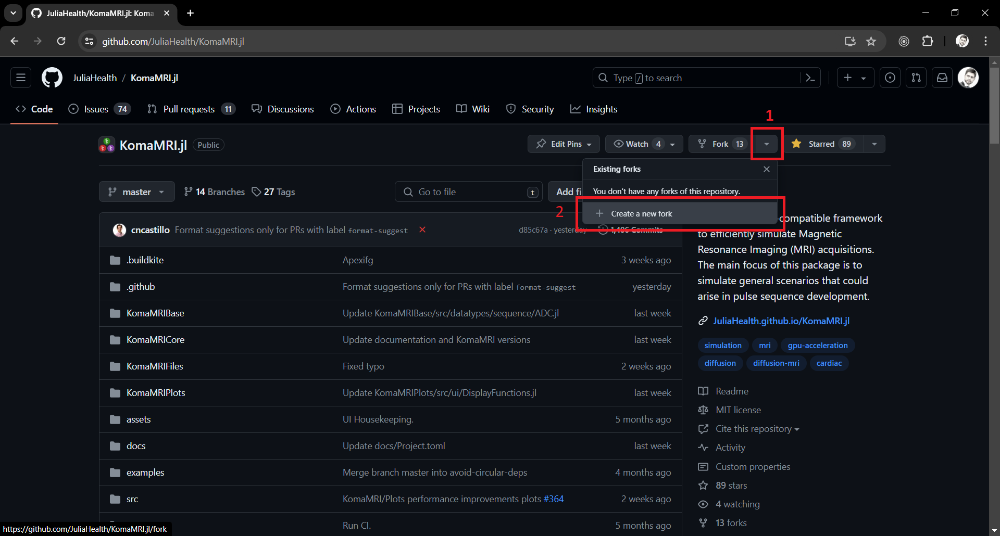
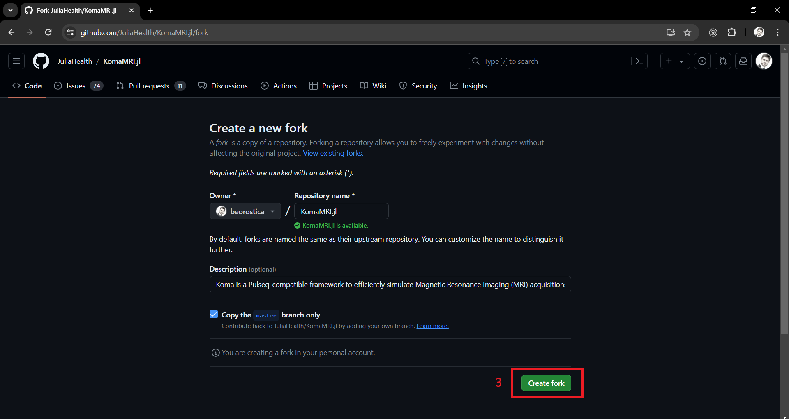

Now, your fork of KomaMRI should look similar to the image below:

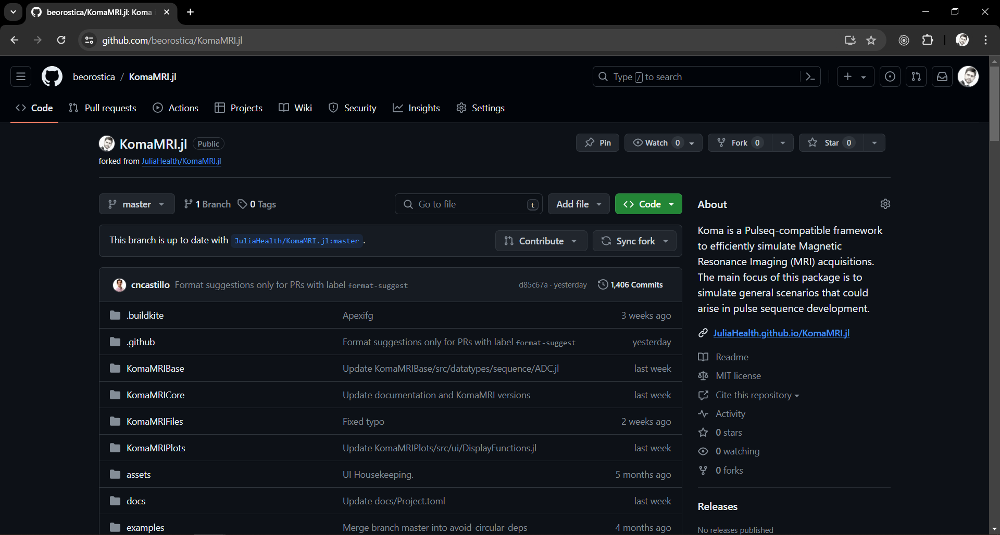

## Setup your Local Git Project

Now, you need to clone your fork of the KomaMRI repository. In Julia, you can do this by opening a Julia REPL, open the package manager with the `]` button and typing the following command (make sure to replace `<github-username>` with your GitHub username):"
```julia-repl
(@v1.10) pkg> dev https://github.com/<github-username>/KomaMRI.jl
```

This saves the local Git project at the `~/.julia/dev/KomaMRI/` directory. You can then open VSCode and navigate to this folder; it should look like this:


## Setup the Julia Environment

To run KomaMRI locally, you need to set up the Julia environment for this project. The environment's information is ultimately defined by the `Manifest.toml` file. However, since you don't have that file yet, you'll need to create it using the information from the `Project.toml` file.

Let's select the environment for your KomaMRI project:


Now, open a Julia REPL:

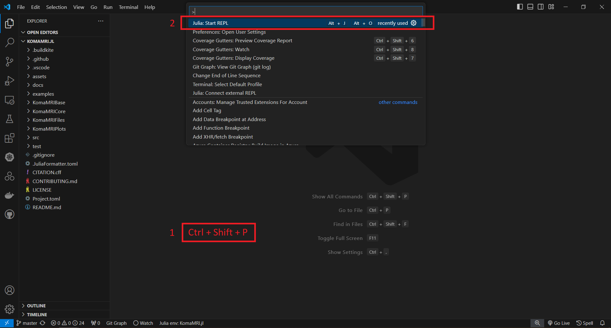

In the Julia REPL, you have to create the `Manifest.toml` file with the `develop` command, considering the local folders `KomaMRIBase`, `KomaMRICore`, `KomaMRIFiles`, and `KomaMRIPlots`. Additionally, you can install all the dependencies listed in the `Manifest.toml` with the `instantiate` command:
```julia-repl
(KomaMRI) pkg> dev ./KomaMRIBase ./KomaMRICore ./KomaMRIFiles ./KomaMRIPlots

(KomaMRI) pkg> instantiate
```

With these steps, your environment has been configured.

## Run KomaMRI Locally

You can now run the KomaMRI's user interface:
```julia-repl
julia> using KomaMRI

julia> KomaUI()
```
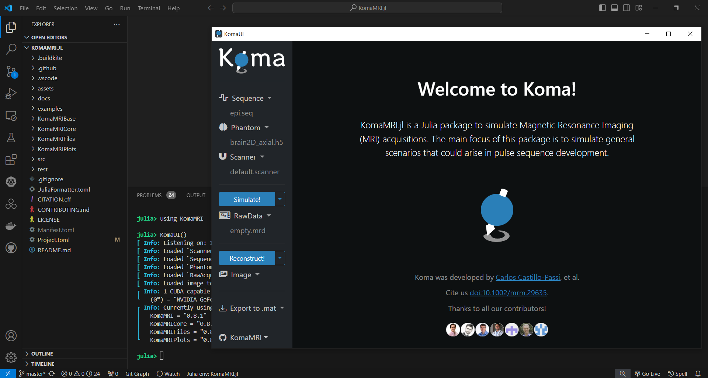

Let's see what the default phantom is in the user interface by clicking on the `Phantom dropdown` and then pressing the `View Phantom` button:

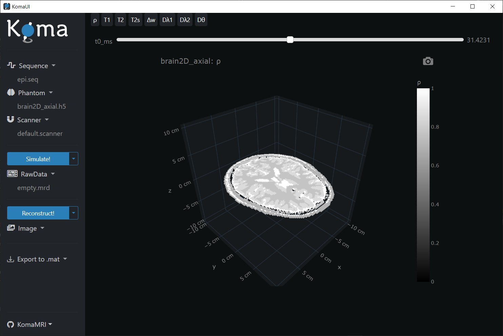 

You can close the KomaMRI's user interface.

## Make Changes and Upload Them

So far so good. However, if you want to make some changes to your GitHub Fork or even contribute to the KomaMRI project, you'll need to make some changes to the local Git repository. In the following example, we will change the default phantom displayed in the user interface.

First, create a branch with a descriptive name. For example, you can use `patch-ui-default-phantom` as the branch name:

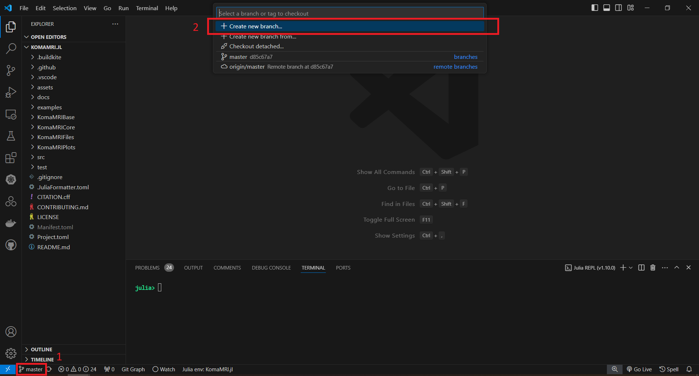
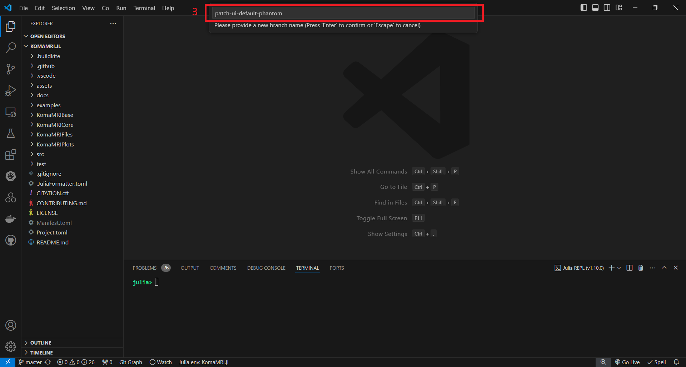

In this new branch, we are going to edit the `setup_phantom` function located in the file `src/ui/ExportUIFunctions.jl`. Specifically, we will replace the line where a brain phantom is defined with the function `pelvis_brain2D`:

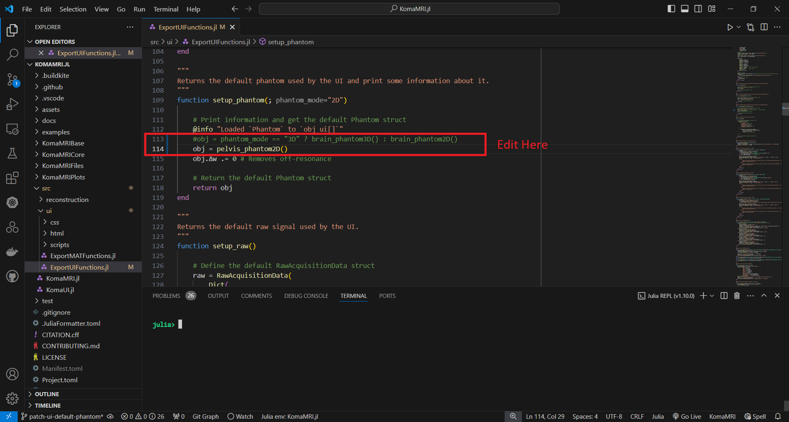

Next, compile the function `setup_phantom`. Simply place the cursor inside the `setup_phantom` function and press `Alt + Enter`:

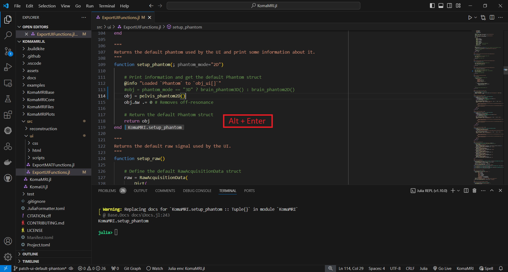

Now, let's see the new default phantom in the user interface by clicking on the `Phantom dropdown` and then pressing the `View Phantom` button:

```julia-repl
julia> KomaUI()
```


Everything looks good; we effectively changed the default phantom. Let's stage the changes:

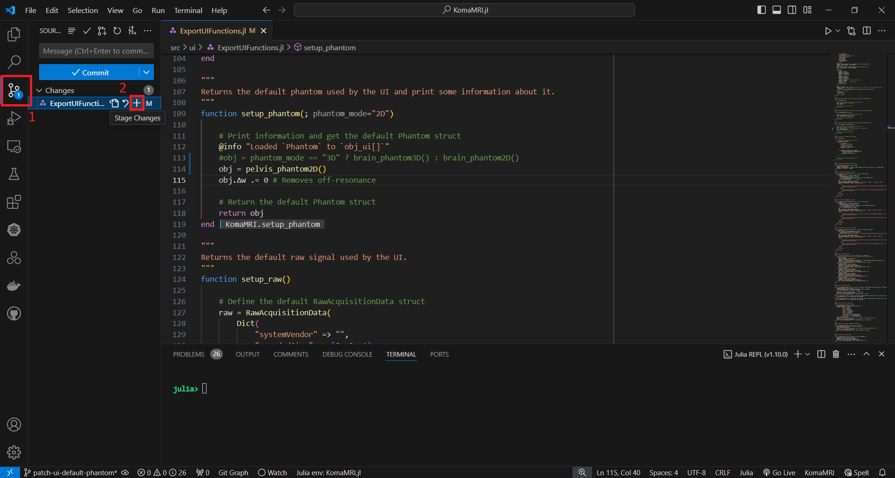

And commit the changes:

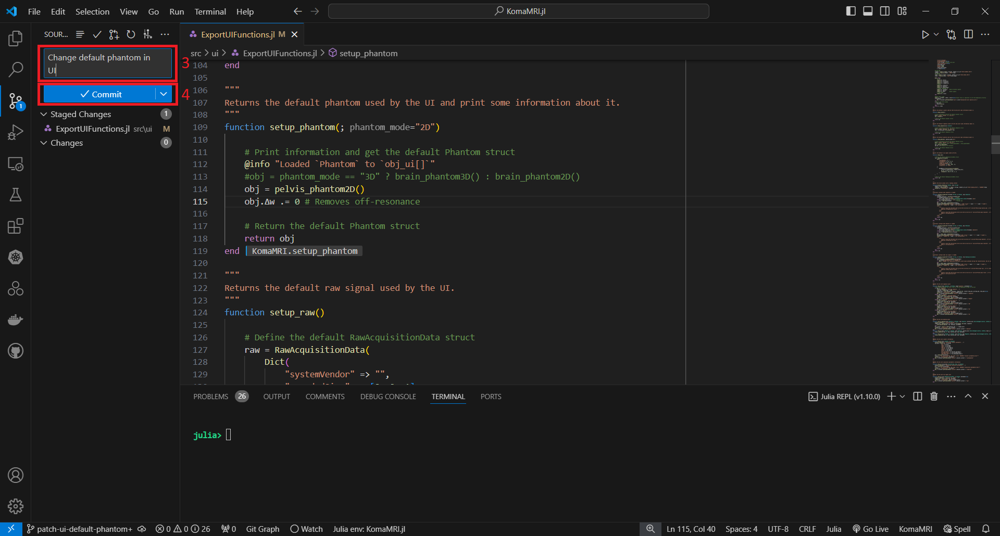

Let's upload these changes to your GitHub fork or to the official KomaMRI repository by selecting the `origin` or the `upstream` option, respectively:

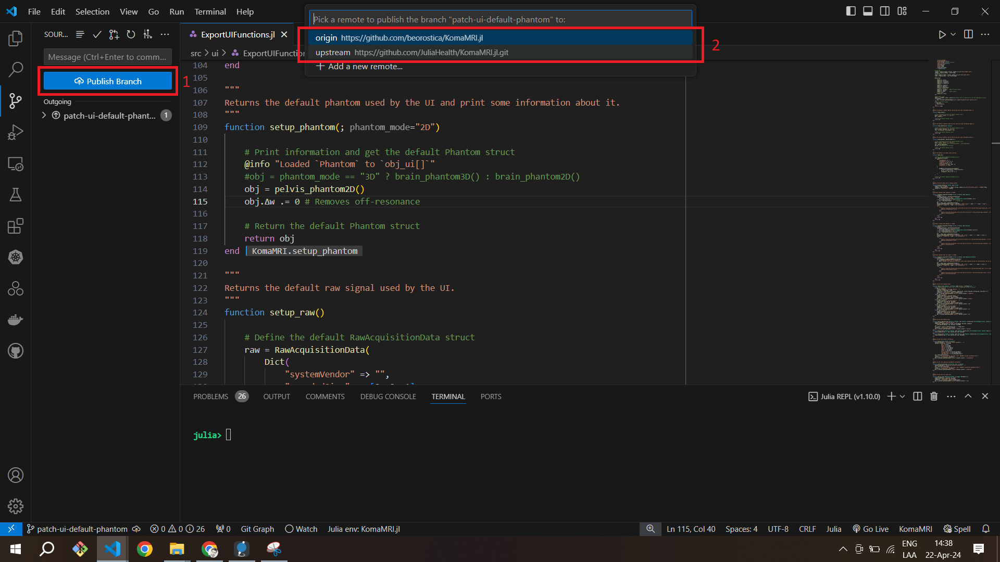

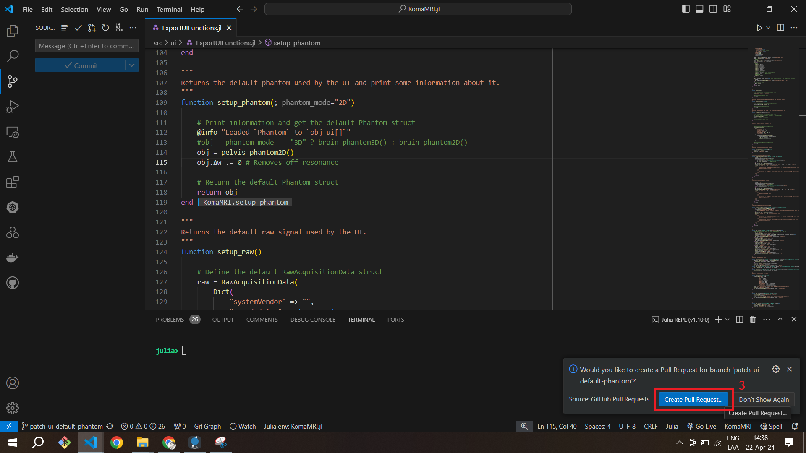

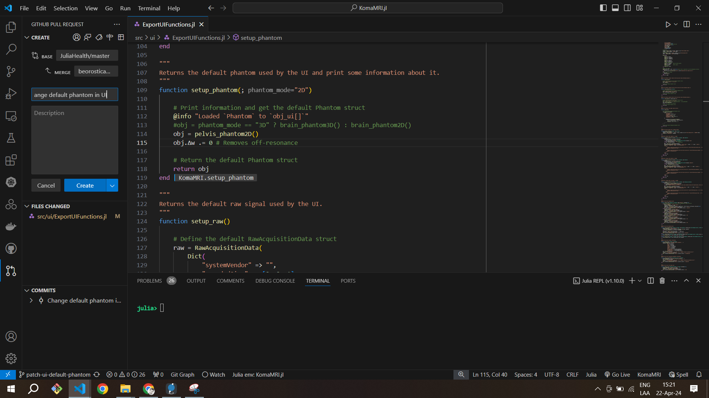

Well done! You have uploaded your changes in a branch to a remote repository.


## About Julia Environments and Subdirectories

So far, the `KomaMRI` package has 4 subdirectories: `KomaMRIBase`, `KomaMRICore`, `KomaMRIPlots`, and `KomaMRIFiles`. These subdirectories are proper Julia packages by themselves, so each has its own `Project.toml` file, which needs to resolve an environment defined ultimately by a `Manifest.toml`.

This is how these packages are related:
- `KomaMRIBase` doesn't depend on any of these other subdirectories.
- `KomaMRICore` depends directly on `KomaMRIBase`.
- `KomaMRIPlots` depends directly on `KomaMRIBase`.
- `KomaMRIFiles` depends directly on `KomaMRIBase`.
- `KomaMRI` depends directly on `KomaMRICore`, `KomaMRIPlots`, and `KomaMRIFiles`."

If you want to edit only the direct contents of one of these packages, you simply need to activate the Julia package and then instantiate it to generate the `Manifest.toml` file and install dependencies. However, if you want to make changes that involve the packages and their direct dependencies, you need to create an environment that reflects those dependencies.

For instance, to edit `KomaMRICore` and its direct dependency `KomaMRIBase` you need to create the `Manifest.toml` like so:
```julia-repl
user@machine ~/.julia/dev/KomaMRI
$ julia

(@v1.10) pkg> activate KomaMRICore

(KomaMRICore) pkg> dev ./KomaMRIBase
```

And for creating the `Manifest.toml` file for `KomaMRI`, which considers all the subdirectories, you have to do the following:
```julia-repl
user@machine ~/.julia/dev/KomaMRI
$ julia

(@v1.10) pkg> activate .

(KomaMRI) pkg> dev ./KomaMRIBase ./KomaMRICore ./KomaMRIFiles ./KomaMRIPlots
```
