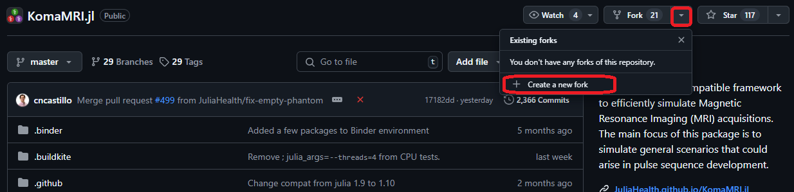
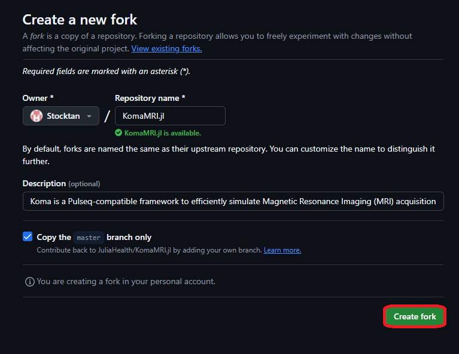
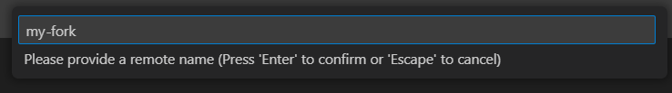
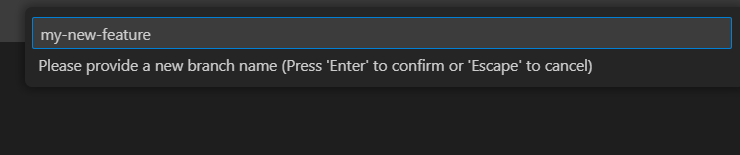

# Contribute to Koma

If you're interested in contributing to Koma, this document will guide you through the setup process. Before you begin, make sure to install and configure a few essential tools on your machine to ensure a smooth development experience:

- Git
- GitHub
- VSCode
- VSCode Plugins: 
    - Julia 
    - GitHub Pull Requests

## Installing KomaMRI as a developer
### 1. Clone KomaMRI repository

To install the dev version of Koma, we will use the Julia REPL:
```julia
pkg> dev KomaMRI
``` 
This command will clone KomaMRI.jl's repository (`dev` version) to your `~/.julia/dev/KomaMRI/` directory if you are in a macOS or Linux operating system, or `C:\Users\<user-name>\.julia\dev\KomaMRI\` if you are using Windows, where `<user-name>` should be replaced with your Windows user.

### 2. Create Your Fork Of KomaMRI

If you try to commit or generate a pull request at this point, you will get an `Access denied` error. This is because you need to create a fork before you can contribute to this repository directly (unless you are included as a collaborator!).

To create this fork, go to the official [KomaMRI repository](https://github.com/JuliaHealth/KomaMRI.jl) and follow the steps below:



 
  
### 3. Access Your GitHub Account In VSCode

Now, you need to ensure that your GitHub account is connected to VSCode. This allows you to clone repositories, create branches, and manage pull requests directly within VSCode.

- Open VSCode.
- Go to the **Source Control** tab.
- Sign in to your GitHub account if you're not already signed in.

>💡You can also check if your `git` credentials are correctly added to your machine by writing in the VSCode terminal:
>```shell
>git config --global user.name
>git config --global user.email
>```

### 4. Open Your Forked Repository In VSCode

In VSCode, click on **File** -> **Open Folder...** and select your `~/.julia/dev/KomaMRI/` directory (`C:\Users\<user-name>\.julia\dev\KomaMRI\` if you are using Windows).

Now add the fork URL by clicking **Source Control** -> **...** -> **Remote** -> **Add Remote...**

```@raw html
    
```
This will create the option to provide a repository URL. Here is where you will paste your fork URL and give it the name `my-fork`.



 
  
>💡Press `Yes` when prompted to constantly fetch in the future.

The Julia extension should automatically detect the `KomaMRI` environment. To check this, look at the status bar (bottom) and you should see `Julia env: KomaMRI`. If this is not the case, click the option in the menu bar and select KomaMRI.jl.

### 5. KomaMRI Monorepo Setup

As KomaMRI.jl contains multiple packages in one GitHub repository, you need to specify that you want to use your local copies (instead of the ones available on the Julia registries) and using the `instantiate` command to install all the required packages (specified in `Project.toml`) with the following script:

```julia
using Pkg  
# Koma sub-packages dev setup  
koma_subpkgs = ["KomaMRICore", "KomaMRIFiles", "KomaMRIPlots"]  
for pkg in koma_subpkgs  
    Pkg.activate(pkg)  
    Pkg.develop(path = "./KomaMRIBase")  
end  
# Main package (KomaMRI) dev setup  
Pkg.activate(".")  
for pkg in koma_subpkgs  
    Pkg.develop(path = "./$pkg")  
end
Pkg.instantiate()
```
In case you want to contribute specifically to documentation, you will need to use the `docs` environment with the following script:

```julia
Pkg.activate("docs")
Pkg.develop(path = ".")
Pkg.instantiate()
```

This will also include all the specific package versions into the `Manifest.toml`. The `Manifest.toml` should not be updated to the repo when making a commit or pull request. Thus, it is present in the `.gitignore`.

### 6. Create A New Branch For Your Feature

If you correctly followed the previous steps you will have created your fork connected to the original Koma repository. Now, if you want to create your own changes, you will need to create a new branch from your fork.

To create this new branch, go to **Source Control** -> **...** -> **Branch** -> **Create Branch form...**

```@raw html
    
```
This will open a menu to select a starting point for your branch. Select `my-fork/master` as your starting point, and give it the name `my-new-feature`.




>💡In your VSCode terminal use `git status` to check if your branch is correctly created. Your branch should be listed at the top of the output. 

## How To Commit

If you have already created your first modifications in your local version of the repository, you will want to commit your changes in your public branch.

To do this, in VSCode go to the Source Control panel in the Activity Bar.

Assuming you are currently in your `my-new-feature` branch, the Source Control panel should show your changes to the project and the option to create a commit message.

```@raw html
    
```
If you hover over the `Changes` tab, it should show a `+` icon. Press it to stage all changes in the project.

Write down a message that describes the changes you are staging to the project, and press the Commit button.

Press **Sync Changes** to push your commit into your branch (this step is equivalent to `git push ...`).

>💡 If you want to make sure the commit was correctly done, check your GitHub repository and see if the changes you committed are present.

## How to Test Your Contributions

Depending on the package where you made your changes, `KomaMRIBase`, `KomaMRICore`, `KomaMRIFiles`, `KomaMRIPlots` or `KomaMRI`, follow the instructions below to test them correctly:

### Test `KomaMRI`:

In the Julia REPL run the following script:

```
pkg> test
```

This should open the UI and all buttons will be clicked to test their functionality.

### Test `KomaMRIBase`, `KomaMRIFiles` or `KomaMRIPlots`:

For all of these packages tests look the same. There are two options to run the tests:


**Test With VSCode**: 

On the activity bar, open the `Testing` extension, expand the available tests, and select the "▶" icon next to the respective package to run the test. The results will be displayed in the `Test Results` panel. 

```@raw html

```

**Test With Julia REPL**: 

Run the following script after replacing `[package]` with the selected `KomaMRIBase`, `KomaMRIPlots` or `KomaMRIFiles` package:

```
pkg> test [package]
```

    
### Test `KomaMRICore`:
In this package, you may want to run tests using the CPU or GPU. By default the tests will run on the CPU, with the number of threads set to `Threads.nthreads()`. You can run KomaMRICore tests using the Julia REPL or VSCode, but some changes are required to choose the backend to be tested.

**Test With VSCode:**

To run KomaMRICore's tests, on the activity bar, open the `Testing` extension, expand the available tests, and select the "▶" icon next to the word `KomaMRICore` to run the test. The results will be displayed in the `Test Results` panel.

```@raw html
    
```

To change the default backend used for testing, modify the `[preferences.KomaMRICore]` section in KomaMRICore/test/project.toml file:

```julia
[preferences.KomaMRICore]
test_backend = "CPU"
```
The variable `test_backend` can be changed to “CPU”, “CUDA”, “AMDGPU”, “Metal”, or “oneAPI”. After this change, **restart VSCode**. Make sure that the required backend is installed in Julia’s global environment before testing. This is, for example, `@v1.10` for Julia 1.10.

**Test With Julia REPL:**

By default, tests are run on the CPU with the number of threads set to `Threads.nthreads()`. To choose a specific backend, two methods exist: 

**Method 1 - Using Preferences:** Add the name of the backend ("CPU","CUDA","AMDGPU","Metal", or "oneAPI") to the `test/Project.toml` file in `KomaMRICore`. Then, test as usual:

```
pkg> test KomaMRICore
```

**Method 2 - Using Test Arguments:** This method is used in Buildkite's CI, and it is best visualised by the use of examples.

Examples:
- To run on the GPU using CUDA:

```
import Pkg

Pkg.test("KomaMRICore"; test_args=`CUDA`)
```    
- To run on the CPU with a specific number of threads, pass the number of threads as a Julia argument:

```
import Pkg

Pkg.test("KomaMRICore"; julia_args=`--threads=4`)
```    

## Adding A New Test

In case your contribution generates a method that is not currently tested, **the code coverage will decrease** when the pull request is analyzed, creating an automatic comment if the code coverage goes below a threshold.

To test your function, add a test into the `runtests.jl` file corresponding to the package where you made your contribution.

Test example:
```julia
@testitem "my math" tags = [:base] begin # @testitem: Runnable from VSCode (tag them!)
    @testset "plus operation" begin # @testset: Adds a name to section
        @test 1 + 1 == 2 # @test boolean: Test. You can include multiple tests per section
        @test 4 + 1 == 5
    end
    @testset "minus operation" begin
        @test 1 - 1 == 0
    end
end
```
Once the file is selected, check whether the contribution to the test fulfills the conditions for an existing `@testitem`. If not, create a new `@testitem`.

Please add `tags` in your `@testitem`'s for them to work properly. The possible tags are:

- KomaMRIBase: `:base`
- KomaMRICore: You must include `:core` and **one** of the following:
    - Test uses motion: `:motion`
    - Test does not use motion: `:nomotion`
- KomaMRIPlots: `:plots`
- KomaMRIFiles: `:files`
- KomaMRI: `:koma`

## How To Create A Pull Request

If you want to send your committed new version of the repository, you can create a pull request that will be reviewed by a Koma certified developer.

To create this pull request, in VSCode, go to the `GitHub Pull Request` panel in the Activity Bar and hover over the `Pull request` tab. This should show a Create pull request icon to press.

```@raw html
    
```

In the `Create` tab that appears, select `JuliaHealth/master` as the base and the branch you are working with to merge.

To finish your pull request, give it a name with a clear mention of the subject of the contribution you made, and a description that explains the issue or feature you are addressing in your branch, and press the Create button.

```@raw html
    
```
 
  
>💡 **Tips For A Successful Pull Request:**
>   - Try to address one issue or feature per pull request to make it easier for reviewers.
>   - Provide all the context necessary, including all the information of the related issue or added feature.
>   - Respond to feedback and suggestions to make adjustments based on the reviewers' comments.

### (Advanced) GPU CI Testing

KomaMRI runs continuous integration tests on multiple GPU backends (CUDA, AMDGPU, Metal, oneAPI) via Buildkite. To control resource usage and costs, **GPU tests are not run by default** on pull requests.

If your contribution affects GPU code, such as files in `KomaMRICore/ext/` or simulation kernels, please request `@cncastillo` to add the `run-gpu-ci` label to your PR.