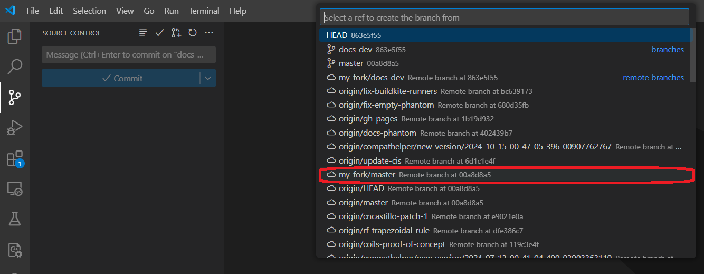

# Contribute to Koma

If you're interested in contributing to Koma, this document will guide you through configuring everything you need to get started. By contributing, you help enhance the functionality, usability, and performance of the Koma ecosystem. Your efforts are welcomed because it help us to advancing the project. Before you begin, it's necessary to install and configure a few essential tools on your machine to ensure a smooth development experience:

- Git
- GitHub
- VScode
- VScode Plugins: 
    - Julia 
    - GitHub Pull Requests

## Installing KomaMRI as a developer
### 1. Clone KomaMRI repository

To install the dev version of Koma, we will use the Julia REPL:
```julia
pkg> dev KomaMRI
``` 
This command will clone KomaMRI.jl's repository (`dev` version) to your `~/.julia/dev/KomaMRI/` directory if you are in a MacOS or Linux operative system, or `C:\Users\<user-name>\.julia\dev\KomaMRI\` if you are using Windows, where `<user-name>` should be replaced with your Windows user.

### 2. Create your fork of KomaMRI

If you try to commit or generate a pull request at this point, you will get an `Access denied` error. This is because you need to create a fork before you can contribute to this repository directly (unless you are included as a collaborator!).

To create this fork, go to the official [KomaMRI repository](https://github.com/JuliaHealth/KomaMRI.jl) and follow the steps below:


### 3. Access your GitHub account in VSCode

Now, you need to ensure that your GitHub account is connected to VSCode. This allows you to clone repositories, create branches, and manage pull request directrly within VSCode.

- Open VSCode.
- Go to the **Source Control** tab.
- Sign in to your GitHub account if you're not already signed in.

>💡You can also check if your `git` credentials are correctlly added to your machine by writing in the VScode terminal:
>```shell
>git config --global user.name
>git config --global user.email
>```

### 4. Open your forked repository in VSCode

In VSCode, click on **File** -> **Open Folder...** and select your `~/.julia/dev/KomaMRI/` directory (`C:\Users\<user-name>\.julia\dev\KomaMRI\` if you are using Windows).

Now add the fork URL by clicking **Source Control** -> **...** -> **Remote** -> **Add Remote...**

```@raw html
    
```
This will create the option to provide a repository URL. Here is where you will paste your fork URL and give it the name `my-fork`.


>💡Press `Yes` when prompted to constantly fetch in the future.

The Julia extension should automatically detect the `KomaMRI` environment. To check this, look at the status bar (bottom) end you should see `Julia env: KomaMRI`. If this is not the case, click the option in the menu bar and select KomaMRI.jl.

### 5. KomaMRI monorepo setup

As KomaMRI.jl contains multiple packages in one GitHub repository, you need to specify that you want to use your local copies (instead of the ones available on the Julia registries) and using the `instantiate` command to install all the required packages (specified in `Project.toml`) with the following script:

```julia
using Pkg  
# Koma sub-packages dev setup  
koma_subpkgs = ["KomaMRICore", "KomaMRIFiles", "KomaMRIPlots"]  
for pkg in koma_subpkgs  
    Pkg.activate(pkg)  
    Pkg.develop(path = "./KomaMRIBase")  
end  
# Main package (KomaMRI) dev setup  
Pkg.activate(".")  
for pkg in koma_subpkgs  
    Pkg.develop(path = "./$pkg")  
end
Pkg.instantiate()
```
In case you want to contribute specifically in documentation, you will need to use the `docs` enviroment with the following script:

```julia
Pkg.activate("docs")
Pkg.develop(path = ".")
Pkg.instantiate()
```

This will also include all the specific package versions into the `Manifest.toml`. The `Manifest.toml` should not be updated to the repo when making a commit or pull request. Thus, it is present in the `.gitignore`.

### 6. Create a new branch for your feature

If you did correctly follow the previous steps you will have correctly created your fork connected to the original Koma repository. Now, if you want to create your own changes, you will need to create a new branch from your fork.

To create this new branch, go to **Source Control** -> **...** -> **Branch** -> **Create Branch form...**

```@raw html
    
```
This will open a menu to select an starting point for your branch. Select `my-fork/master` as your starting point, and give it the name `my-new-feature`.




>💡In your VScode terminal use `git status` to check if your branch is correctly created. Your branch should be listed at the top of the output.

## How to commit

If you have already created your first modifications in your local version of the repository, you will want to commit your changes in your public branch.

To do this, in VScode go to the Source Control panel in the Activity Bar.

Assuming you are currently in your `my-new-feature` branch, the Source Control panel should show your changes to the project and the option to create a commit message.

```@raw html
    
```
If you hove over the `Changes` tab, it should show a `+` icon. Press it to stage all changes in the project.

Write down a message that describes your changes you are stageing to the project, and press the Commit button.

Press Sync Changes to push your commit into your branch.

>💡 If you want to make sure if the commit was correctly done, check your GitHub repository and see if the changes you commited are present.

## How to create a pull request

If you want to send your commited new version of the repository, you can create a pull request that will be reviewed by a Koma certified developer.

To create this pull request, in VScode, go to the `GitHub Pull Request` panel in the Activity Bar and hove over the `Pull request` tab. This should show a Create pull request icon to press.

```@raw html
    
```

In the `Create` tab that appears, select `JuliaHealth/master` as the base and the branch you are working with to merge.

To finish your pull request, give it a name with a clear mention of the  subject of the contribution you made, and a description that explains the issue or feature you are addresing in your branch, and press the Create button.

```@raw html
    
```
>💡 **Tips for a successful Pull Request:**
>   - Try to address one issue or feature per pull request to make it easier for reviewers.
>   - Provide all the context necesary, including all the information of the related issue or added feature.
>   - Respond to feedback and suggestions to make adjustments based on the reviewers comments.
