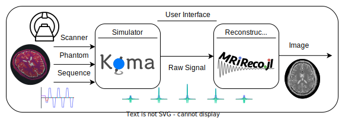
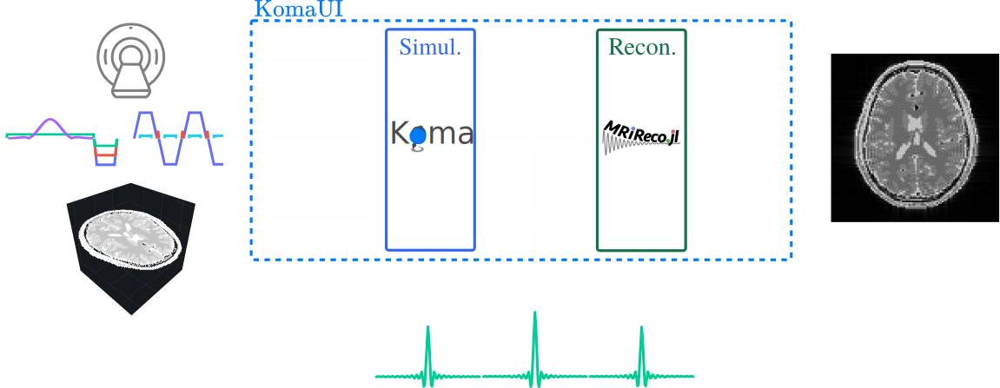

## Introduction

**KomaMRI** is a Julia package meant to simulate general Magnetic Resonance Imaging (MRI) scenarios. Its name comes from the Japanese word for spinning-top こま (ko-ma) as they precess due to gravity like spins in a magnetic field.

**KomaMRI** generates **raw data** by solving the **Bloch equations** using the specified **scanner**, **phantom** and **sequence**. It also provides a Graphical User Interface (GUI) that encapsulates the whole imaging pipeline (simulation and reconstruction).

```@raw html
<p align="center"></p>
<p align="center"></p>
```
We organized the documentation following the philosophy presented by [David Laing](https://documentation.divio.com/).

!!! details "How to Cite Koma"
    If you use Koma, please cite our paper:

    **Plain Text:**

    ```
    Castillo-Passi, C, Coronado, R, Varela-Mattatall, G, Alberola-López, C, Botnar, R, Irarrazaval, P. KomaMRI.jl: An open-source framework for general MRI simulations with GPU acceleration. Magn Reson Med. 2023; 1- 14. doi: 10.1002/mrm.29635
    ```

    **BibTex:**
    
    ```
    @article{https://doi.org/10.1002/mrm.29635,
            author = {Castillo-Passi, Carlos and Coronado, Ronal and Varela-Mattatall, Gabriel and Alberola-López, Carlos and Botnar, René and Irarrazaval, Pablo},
            title = {KomaMRI.jl: An open-source framework for general MRI simulations with GPU acceleration},
            journal = {Magnetic Resonance in Medicine},
            keywords = {Bloch equations, GPU, GUI, Julia, open source, simulation},
            doi = {https://doi.org/10.1002/mrm.29635},
            url = {https://onlinelibrary.wiley.com/doi/abs/10.1002/mrm.29635},
            eprint = {https://onlinelibrary.wiley.com/doi/pdf/10.1002/mrm.29635},
    }
    ```

## Features

* Fast simulations by using CPU and GPU parallelization 🏃💨.
* Open Source, so anyone can include additional features 🆙.
* Compatibility with community-standards 🤝 like Pulseq `.seq` and ISMRMRD `.mrd`.
* Compatibility with [Pluto](how-to/2-2-use-koma-notebooks.md#Pluto) and [Jupyter](how-to/2-2-use-koma-notebooks.md#Jupyter) notebooks 🎈
* Interactive visualizations using PlotlyJS.jl 📲
* Cross-platform 🌐 thanks to the use of the Julia programming language.
* Friendly user interface for people with no programming skills 😌.
* Flexible API for advanced users 👨‍💻.

## Potential Use Cases

* The generation of synthetic data to train Machine Learning models.
* To test novel pulse sequences before implementing them directly in a real scanner (with a Pulseq sequence).
* Teaching exercises for **MRI** acquisition or reconstruction.